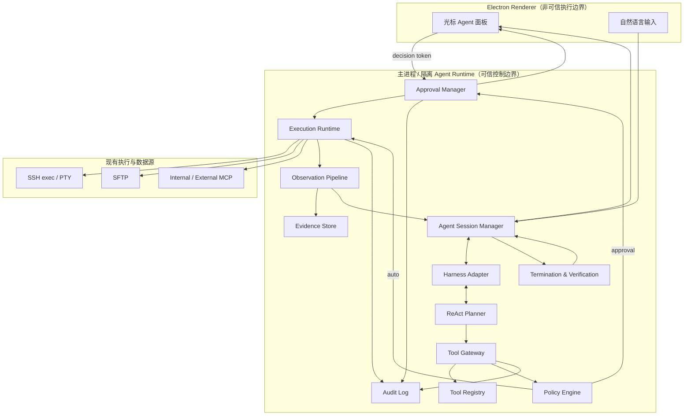
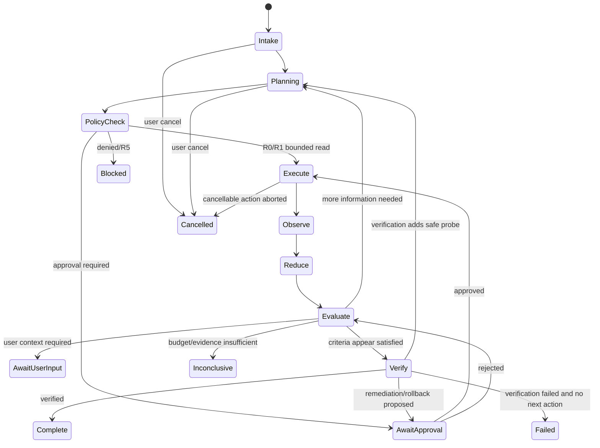
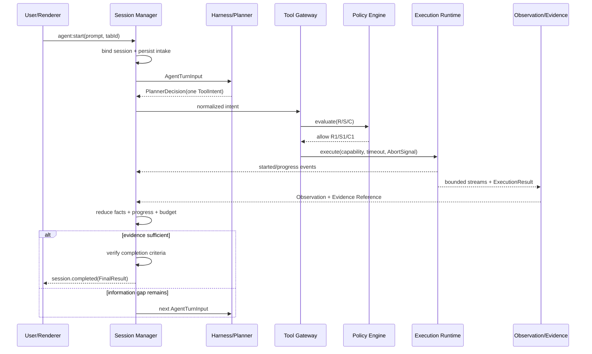
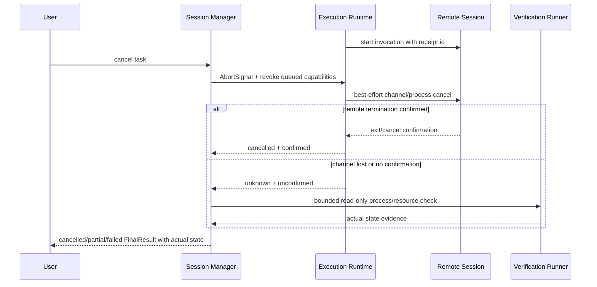
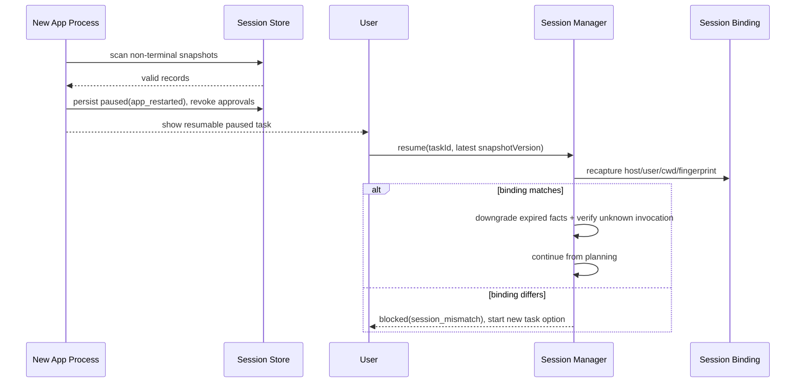
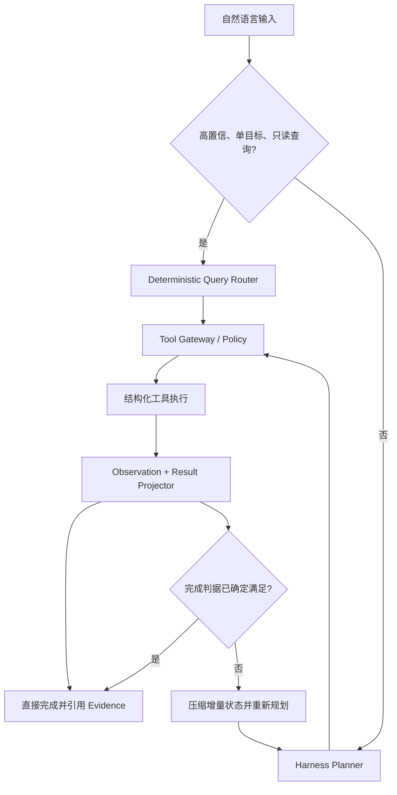

## Context

参见 [proposal.md](./proposal.md) 的动机与产品范围。本设计覆盖 `agent-orchestration`、`agent-tool-safety`、`agent-observation-management`、`agent-operation-verification` 和 `agent-terminal-experience` 五项新增能力。

OpsHalo 已具备可复用基础，但目前这些能力分散在不同路径：

| 现有能力 | 位置 | 可复用点 | 当前缺口 |
| --- | --- | --- | --- |
| Smart Shell 环境探查 | `src/client/components/ai/smart-shell-utils.js` | 会话信息和环境探针 | 单次探查后直接生成命令，不是多轮 ReAct |
| Agent 工具循环 | `src/client/components/ai/agent.js`、`agent-tools.js` | 模型工具调用和流式消息 | 默认最多 150 轮，缺少统一预算、审批、验证和循环检测 |
| 光标提示面板 | `src/client/components/terminal/terminal-smart-shell-overlay.jsx` | 就地展示 AI 信息 | 缺少任务状态、动作时间线、审批卡和证据查看 |
| SSH exec/PTY/SFTP | `src/client/store/mcp-handler.js` 及主进程连接层 | 退出码、超时、PTY、文件操作 | Agent 内部路径可能绕过主进程统一命令校验 |
| MCP 命令规则 | `src/app/widgets/widget-mcp-server.js` | 黑白名单和命令检查 | 规则局限于部分 MCP 路径，不能覆盖全部内外部工具 |
| 对话压缩 | `src/client/store/common.js` | 手动历史压缩 | 缺少按 Observation 和 Evidence 管理的工作记忆 |

约束如下：

- Electron 渲染进程按不可信调用方处理，不能持有最终执行权限或自行认定审批完成。
- 首期绑定单个 Linux SSH 标签页，复用既有连接与凭据，不创建新的服务器代理。
- 模型供应商和工具调用能力不统一，业务协议不能绑定单一 SDK。
- 运维输出可能巨大、敏感且包含提示注入内容，不能原样进入模型历史。
- 用户希望在终端内看到过程和依据，但产品不得暴露模型隐藏思维链。

## Goals / Non-Goals

**Goals:**

- 用一个轻量、可替换的 Harness 接口承接 Strands 与现有 OpenAI 兼容模型。
- 让多轮 ReAct 能按证据动态探查，并由确定性代码强制安全、预算、超时和终止。
- 将“任务拆解、结构化探查、命令检查、执行、输出压缩、验证”组织为职责清晰的组件。
- 统一内部工具、通用 Shell、SFTP、PTY 和 MCP 的安全边界与审计语义。
- 任何结论和变更结果都可通过 Evidence Reference 回看，证据不足时诚实停止。

**Non-Goals:**

- 不采用多个能够相互自由对话、各自持有执行权的 LLM Agent 群。
- 不在首期支持跨主机无人值守操作、定时自治任务或长时间后台运维。
- 不允许模型直接决定最终风险等级、绕过确认或自行输入密码。
- 不把完整原始输出、隐藏思维链或服务器凭据持久化到普通聊天记录。
- 不在本设计阶段决定本地 PowerShell 的命令语义；其适配必须使用独立策略包。

## Architecture



### 职责映射

用户最初提出的多个 Agent 角色保留为职责边界，但不全部实现为独立 LLM：

| 角色概念 | 实现形式 | 原因 |
| --- | --- | --- |
| 任务拆解/调度 Agent | 主 ReAct Planner + Session Manager | 维持单一目标、计划和预算，避免多 Agent 状态漂移 |
| 结构化只读 Agent | 注册表中的组合探查工具 | 输出稳定、范围可控，不需要第二个模型决定命令 |
| 命令检查 Agent | 确定性 Policy Engine；模型仅提供辅助高风险信号 | 安全决策可测试且不可被提示绕过 |
| 通用 Shell 执行 Agent | Execution Runtime | 复用 SSH exec/PTY，统一超时、取消和返回模式 |
| 输出内容 Agent | 规则化 Observation Reducer；超长复杂结果可选小模型摘要 | 优先确定性裁剪和脱敏，降低成本与幻觉 |
| 结果验证 Agent | 预声明验证计划 + 可选独立 Verifier 模型 | 先靠可测试的工具证据，必要时用模型检查矛盾 |

## Decisions

### 1. 一个主 Planner，确定性服务负责控制

每个任务只运行一个拥有任务计划的 ReAct Planner。风险判断、授权、执行、输出处理、预算和停止条件由确定性服务强制执行；可选 Summarizer/Verifier 只能产生摘要或建议，不能取得工具执行权。

选择理由：运维任务最需要一致目标和可审计控制。多个自治 Agent 会复制上下文、增加模型成本，并让“谁批准了什么、谁决定停止”变得模糊。

替代方案：

- 多 Agent 群聊：对复杂研究灵活，但安全边界和循环控制成本过高，首期拒绝。
- 单次大提示生成完整脚本：实现简单，但不能根据错误自适应，也不能在证据不足时可靠停下。

### 2. Harness 是内部端口，不把业务绑定到框架

定义最小 Harness 端口，模型适配器只负责消息、结构化动作、流事件、用量和取消：

```ts
interface AgentHarness {
  runTurn(
    input: AgentTurnInput,
    signal: AbortSignal
  ): AsyncIterable<AgentEvent>
}
```

首期适配器：

- `StrandsHarnessAdapter`：基于官方 `strands-agents/harness-sdk` 单仓库中的 `@strands-agents/sdk`，使用其流式 Agent、结构化输出与 hook 能力，但工具调用仍转交本地 Tool Gateway。该 SDK 为 ESM、Apache-2.0 且要求 Node.js 20+；实施基线统一到 Node.js 20.19+。
- `OpenAICompatibleHarnessAdapter`：保留现有服务商、模型地址和鉴权配置。
- `CodexAppServerHarnessAdapter`：通过官方 `codex app-server --listen stdio://` 使用 ChatGPT/Codex 订阅登录态；App Server 只负责推理、账号和 turn 生命周期，目标服务器工具仍回到 electerm Tool Gateway。
- `StrictJsonHarnessAdapter`：为无原生 tool-calling 的模型校验单动作 JSON；多次不合格后降级为建议模式。

Harness 不直接拿到 SSH/SFTP 对象，只能发出 `ToolIntent`。这样未来替换框架不会改变工具、安全和 UI 协议。

### 3. Session Manager 使用持久、可恢复的显式状态机



`Paused` 是连接丢失、标签页不可用和用户手动暂停的可恢复状态。恢复前重新核对 `sessionId + tabId + host fingerprint + username + cwd`，并废弃所有尚未消费的批准令牌。

每轮 Planner 决策遵循以下逻辑模式；真实字段以 JSON Schema 固化：

```json
{
  "goalStatus": "continue|verify|complete|need_user|blocked",
  "planSummary": "面向用户的短计划",
  "knownFacts": [],
  "missingInformation": [],
  "action": {
    "tool": "docker.logs",
    "arguments": {}
  },
  "reasonSummary": "为什么该动作能缩小信息缺口",
  "expectedObservation": "预期得到什么",
  "completionCriteria": []
}
```

每轮最多提出一个工具动作，防止一批动作在环境变化后继续盲目执行。并行只允许在 Runtime 内对明确独立、全部 R0/R1 的组合探查执行，且作为一个有界工具返回。

### 4. Tool Gateway 是唯一执行入口

Tool Gateway 接收 `ToolIntent`，按以下顺序处理：

1. 验证任务、会话、工具名和参数模式。
2. 从 Tool Registry 合并工具风险下限与运行限制。
3. 对 Shell/PTY/SFTP/MCP 参数做静态分析和目标资源归一化。
4. 由 Policy Engine 输出 `allow`、`require_approval` 或 `deny`，并解释原因。
5. 对需审批动作创建绑定规范化参数哈希的一次性批准令牌。
6. Execution Runtime 执行动作并强制超时/取消。
7. Observation Pipeline 处理结果，Evidence Store 保存证据，Audit Log 记录生命周期。

Renderer 只接收展示事件并回传用户决策；它不能提交“已批准”布尔值，必须携带主进程签发且未过期的批准请求标识。

首期模块边界：

```text
src/app/agent/
  session-manager.js
  harness/
  tools/registry.js
  tools/gateway.js
  policy/
  execution/
  observation/
  evidence/
  verification/
  audit/
src/client/components/ai/agent-session/
  agent-session-overlay.jsx
  timeline-item.jsx
  approval-card.jsx
  evidence-detail.jsx
```

具体文件名可随现有代码组织调整，但可信逻辑必须位于主进程或隔离运行时。

### 5. 优先结构化工具，通用 Shell 兜底

首期工具目录：

- 会话/主机：`session.describe`、`host.profile`
- 进程/网络：`process.list`、`process.detail`、`network.ports`、`network.connections`
- 文件：`filesystem.list`、`filesystem.stat`、`filesystem.read_limited`
- 服务：`service.status`、`service.logs`
- 容器：`docker.list`、`docker.inspect`、`docker.logs`、`docker.stats`
- 指标/配置：`metrics.snapshot`、`config.read_limited`
- 通用执行：`shell.exec`
- 人工交互：`terminal.pty_start`、`terminal.pty_input`、`terminal.cancel`
- 文件变更：现有 SFTP write/delete，经网关包装

结构化工具必须要求范围参数，例如日志默认时间窗口、最大行数、容器/服务名。没有结构化工具可完成目标时才使用 `shell.exec`。

每个工具的注册项至少包含：

```json
{
  "name": "docker.logs",
  "category": "read",
  "mutability": "none",
  "riskFloor": "R1",
  "sensitivity": "S1",
  "approval": "auto_if_bounded",
  "defaultTimeoutMs": 15000,
  "maxTimeoutMs": 30000,
  "maxModelOutputBytes": 6144,
  "supportsCancel": true,
  "inputSchema": {},
  "resultSchema": {}
}
```

### 6. 风险是 R/S/C 多轴模型，最终等级只升不降

副作用等级：

| 等级 | 含义 | 默认处理 |
| --- | --- | --- |
| R0 | 本地上下文、无远端读取 | 自动 |
| R1 | 有界、低敏感只读 | 自动 |
| R2 | 网络、昂贵、范围较大或敏感只读 | 策略确认 |
| R3 | 可逆变更 | 每次确认 |
| R4 | 提权、破坏性、数据外发或难回滚 | 强确认或策略阻断 |
| R5 | 明显不可接受的永久破坏/越权 | 永久阻断 |

敏感度：S0 公共/运行状态，S1 常规内部信息，S2 敏感配置/业务数据，S3 凭据/私钥/高度敏感数据。资源成本：C0 极低、C1 常规、C2 显著、C3 可能影响业务。

最终决策取工具风险下限、Shell AST/词法分析、管道/重定向/命令替换、目标范围、当前用户权限、敏感度、成本和用户策略的最大风险。LLM 的风险建议可以升高风险或请求人工复核，绝不能降低确定性规则给出的等级。

网络只读默认为 R2。自动执行仅限 R0/R1 + S0/S1 + C0/C1 且参数有界。sudo、密码、编辑器、分页器和持续 follow 转为用户接管；交互动作不消耗“批准后即可让模型输入”的权限。

### 7. 审批是绑定动作的一次性能力令牌

审批卡显示：风险 R/S/C、主机、用户、cwd、完整命令/参数、目标资源、是否 sudo/PTY、超时、预期影响、前置检查、验证方式和回滚方案。

默认选项：

- 批准一次。
- 对策略允许的 R2/R3 完全匹配动作，可由用户主动选择“本任务内允许”；主机、资源或参数变化即失效。
- 拒绝本动作。
- 取消任务。

批准令牌绑定 `taskId + sessionFingerprint + normalizedIntentHash + policyVersion + expiry`，只能消费一次。R4 是否显示批准按钮由策略决定，R5 永远只显示阻断原因。

### 8. Execution Runtime 复用现有执行能力并统一控制

SSH exec 用于非交互命令，PTY 仅用于明确需要用户接管的交互场景。所有执行器接受 `AbortSignal`，产生一致事件：`started`、`stdout_chunk`、`stderr_chunk`、`exit`、`timeout`、`cancelled`、`transport_error`。

默认限制：

| 动作 | 默认超时 | 最大超时 |
| --- | ---: | ---: |
| 会话/主机轻探针 | 5 秒 | 10 秒 |
| 进程、端口、服务状态 | 10 秒 | 20 秒 |
| 日志、配置、容器 inspect | 15 秒 | 30 秒 |
| 诊断/指标采样 | 30 秒 | 60 秒 |
| 已批准变更 | 60 秒 | 120 秒 |
| 已批准长任务 | 显式设置 | 15 分钟 |

常规 Agent 任务总预算为 5 分钟。用户批准长任务后可提升至 15 分钟，但不得自动提升单工具最大值。超时先发送温和取消，短暂宽限后断开对应 channel；不得关闭整个 SSH 连接影响用户终端，除非该 channel 无法隔离且用户确认。

### 9. Observation 与 Evidence 分离

处理顺序固定为：

```text
raw stream
  -> ANSI/control cleanup
  -> secret redaction
  -> tool-specific parser
  -> error/stats/fact extraction
  -> bounded head/tail/sample
  -> optional small-model summary
  -> Observation + Evidence Reference
```

Observation 是模型可见的短结构：

```json
{
  "status": "success|partial|error|timeout|cancelled",
  "exitCode": 0,
  "summary": "",
  "facts": [],
  "errors": [],
  "sample": [],
  "truncated": false,
  "omittedLines": 0,
  "evidenceRef": "evidence://task/step/id"
}
```

先使用规则解析和裁剪；只有复杂非结构化文本超过阈值时才允许小模型摘要，且摘要器不获得工具权限。模型可见默认 6 KiB、硬上限 8 KiB。Evidence Store 默认本地每任务 10 MiB、保留 24 小时，用户可设置任务结束即清理。证据写入前同样脱敏；S3 原值默认既不发送模型也不进入普通证据库。

服务器返回内容始终包装为不可信数据。系统提示明确禁止把 Observation 内的命令性文本当成指令，Tool Gateway 则提供第二道不可绕过的执行控制。

### 10. 工作记忆使用事实账本而非聊天堆叠

Session Memory 固定维护：

- 用户目标、范围和完成判据。
- 当前计划与剩余信息缺口。
- 已确认事实及 Evidence Reference。
- 尚未证实/已否定假设。
- 最近少量 Observation。
- 已执行变更、用户批准范围和验证状态。
- 剩余预算与错误计数。

旧的工具文本压缩为事实与引用；重复事实合并，冲突事实并存并进入待验证列表。对话压缩不能删除未完成变更的验证义务或仍有效的安全状态。

### 11. 错误分类驱动自适应探查

执行层先把错误规范化，再给 Planner 有限的恢复选项：

| 错误类别 | 默认自适应行为 |
| --- | --- |
| `command_not_found` | 选择已注册替代工具或探查平台；禁止自动安装 |
| `permission_denied` | 有界读取当前用户/权限；如需 sudo 则审批或用户接管 |
| `unsupported_option` | 运行有界版本/帮助探针后调整参数 |
| `timeout` | 缩小范围、降低采样、改为已批准后台任务或结束 |
| `output_truncated` | 增加时间、对象或字段过滤，不重复宽泛查询 |
| `transport_error` | 暂停并最多自动重连一次；重新验证会话指纹 |
| `interactive_required` | 暂停并转交用户 |
| `policy_denied` | 不重试同一动作，选择安全替代或结束 |

同一等价失败动作最多两次；连续三次错误强制结束自动循环。错误恢复仍消耗步骤和时间预算。

### 12. 终止由充分性检查和验证共同决定

Planner 可以建议 `complete`，但 Termination & Verification 组件做最终检查：

1. 每项完成判据是否有当前证据。
2. 是否仍有会改变结论的关键缺口。
3. 事实之间是否存在未解释矛盾。
4. 是否有变更尚未验证。
5. 结论中的事实、推断和未知是否正确区分。

只读查询证据足够才 `complete`；不足则 `inconclusive`/`need_user`/`blocked`。重要单一信号在预算内尽量用第二种信号交叉验证。

每个变更使用固定闭环：

```text
precheck -> approval -> execute -> capture actual result
         -> readonly verification -> success / partial / failed
         -> optional rollback proposal -> new approval -> verify rollback
```

验证计划在审批前产生并展示。命令退出码为零不是充分成功条件；验证失败时停止依赖该变更的后续动作。

### 13. UI 是事件时间线，不是第二个状态源

Session Manager 通过有序 `AgentEvent` 流驱动 UI，事件带 `taskId`、`sequence`、`timestamp` 和可恢复快照版本。Renderer 仅投影状态，不自行推断工具是否成功或审批是否有效。

面板布局：

- 顶栏：状态、当前步骤/上限、耗时、暂停/停止。
- 当前步骤：决策摘要、工具名/目标、预计观察、执行状态。
- 历史步骤：默认折叠，展示耗时、结果摘要和 Evidence Reference。
- 审批卡：完整动作、R/S/C、影响、验证、回滚和决策按钮。
- 最终卡：结论、证据、执行操作、验证、未解决项和终止原因。
- 详情抽屉：按需查看清洗证据和截断元数据，不自动回填模型上下文。

显示的是 plan/reason summary，不展示隐藏 chain-of-thought。任务结束后的追问继承事实账本与证据引用，不继承过期审批。

### 14. 默认预算和策略集中配置

| 配置项 | 默认值 | 说明 |
| --- | ---: | --- |
| `maxReactSteps` | 12 | 用户可在策略上限内扩展 |
| `hardMaxReactSteps` | 20 | 任何任务不得绕过 |
| `maxAutoReadActions` | 8 | R0/R1 自动只读次数 |
| `maxEquivalentActionRepeats` | 2 | 规范化动作重复阈值 |
| `maxConsecutiveErrors` | 3 | 达到后结束自动循环 |
| `taskTimeoutMs` | 300000 | 常规总任务 5 分钟 |
| `approvedLongTaskMaxMs` | 900000 | 明确批准后 15 分钟 |
| `modelObservationBytes` | 6144 | 单 Observation 默认上限 |
| `modelObservationHardMaxBytes` | 8192 | 模型可见硬上限 |
| `evidenceQuotaBytes` | 10485760 | 每任务 10 MiB |
| `evidenceRetentionHours` | 24 | 本地短期保留 |

策略版本写入任务与审批记录。设置变化只影响下一动作；若降低权限或缩短预算则立即生效，扩大权限不得自动影响正在运行的任务。

### 15. 审计与隐私

审计记录使用追加事件，包含任务/会话匿名标识、工具、参数摘要或哈希、策略版本与理由、审批决策、开始/结束时间、退出状态、截断信息和 Evidence Reference。默认不记录凭据、完整命令输出和隐藏思维链。

Evidence Store 和 Audit Log 分开：Evidence 可按 24 小时/配额清理，审计仍能证明“何时依据哪个策略执行了什么类别动作”，但不能还原敏感原文。用户可以在设置中立即清理任务证据。

### 16. 测试与评估从确定性层向外展开

- Policy 单元测试：R0-R5、S0-S3、C0-C3、管道/重定向/命令替换、sudo、外发、SFTP 和 MCP 变体。
- 状态机属性测试：非法转换、重复事件、取消竞态、预算边界、批准令牌重放和恢复后令牌失效。
- Observation 单元测试：ANSI、二进制、编码、超长行、秘密模式、提示注入和截断。
- Execution 集成测试：SSH exec、PTY 转交、超时、取消、断线、部分输出和 channel 隔离。
- Agent 场景评估：命令不存在、权限不足、日志截断、矛盾证据、信息不足、变更成功但验证失败。
- Playwright 端到端：时间线、审批一次/拒绝/取消、证据详情、最终状态和追问上下文。
- 安全回归：任何内部/外部工具都无法绕过 Gateway；修改审批后的参数不能复用令牌。

模型评估只判断计划质量、信息缺口和结论引用；安全测试不能依赖模型概率性通过。

### 17. AI 后端是持久化互斥选择，不是自动回退链

设置新增 `aiBackendType: 'openai_compatible' | 'codex_subscription'`。原有 Provider、Base URL、Model、API Key 与 Smart Shell/聊天配置原样保留；升级旧配置时默认 `openai_compatible`。Codex 类型另存 profile 元数据和当前 `profileId`，切换类型只改变新请求的路由，不删除另一类型配置。

选择理由：API Key 与 ChatGPT/Codex 订阅属于不同鉴权和计费边界。自动 fallback 会造成用户无法判断正在消耗哪一类额度，也可能把敏感任务发给非预期 Provider。

约束：

- 一个设置快照只能有一个生效类型；非法值 fail closed 到配置错误，不同时启用两套 Harness。
- 活跃 task 固定创建时的 backend/profile；设置变化只影响后续 task。
- 当前 backend 不可用时显示重新授权、重试或手工切换，不跨类型静默回退。
- Codex Subscription 首期只进入 Agent Harness；现有 Smart Shell/普通聊天继续使用原 OpenAI Compatible 配置，若产品入口要求当前类型统一，则 Codex 类型下明确禁用不支持的旧入口并解释原因。

### 18. Codex 认证由官方 App Server 持有并按 profile 隔离

主进程启动 `codex app-server --listen stdio://`，完成 initialize 后使用 `account/login/start`、`account/read`、`account/rateLimits/read` 和 logout 能力。浏览器 OAuth 为默认方式，设备码为无本地回调或用户主动选择时的替代方式。OpsHalo 不实现固定 client id、token endpoint、refresh rotation 或 Token/JSON 导入。

发行构建固定 `@openai/codex` 稳定版本，并将当前 `platform + arch` 对应的原生 App Server 及其同目录辅助程序放入 ASAR 外的只读资源目录。运行时默认只解析随包资源，不探测系统 PATH，也不依赖目标机器安装 Node.js、Volta、Codex CLI 或 Codex Desktop。设置中的绝对可执行路径是显式高级诊断覆盖项；未配置时若内置文件缺失，系统 fail closed 为安装完整性错误，不得静默执行系统上的未知版本。CI/打包验收必须从最终产物资源路径启动 App Server、完成 initialize/account read/最小 turn，并校验实际可执行路径属于安装目录。

每个账号的 App Server 使用独立运行目录：

```text
<electron-userData>/ai-accounts/codex/v1/
  profiles.json                    # 原子写；仅脱敏元数据和当前 profileId
  profiles/<profileId>/codex-home/ # 仅当前用户可读写；由 App Server 管理认证文件
  profiles/<profileId>/runtime/    # 空工作目录、pid/版本/健康状态；不含服务器证据
```

一个 profile 同时最多一个 App Server 进程，防止 refresh rotation 竞争。切换 profile 前必须确认没有绑定该 profile 的非终止 task；删除账号先停止进程、调用 logout/清理 profile，并保留不含秘密的审计摘要。不得读取、展示或投影 App Server 保存的原始 OAuth Token，也不得写用户全局 `~/.codex/auth.json`。

### 19. App Server 工具能力必须回到本地安全网关

App Server 是 Harness/Planner 来源，不是第二个执行 Runtime。主进程对 App Server 本机 command/file approval 一律拒绝；进程以空工作目录、最小环境和受限权限启动。目标 SSH 主机只通过 electerm 注册的工具桥暴露，桥接结果是 `PlannerDecision.action/ToolIntent`，随后完整经过 Registry → Gateway → Policy → Approval → Execution → Observation → Verification。

首选稳定 MCP 工具桥；若所用 Codex 版本只能使用实验性 dynamic tools，则对应功能保持 feature flag 关闭，直到版本 capability probe 和无旁路契约测试通过。无论协议为何，App Server 的批准或 sandbox 结果只能提高本地风险，不能代替或降低 electerm Policy。

`Ctrl+C`/停止按钮先触发现有 task AbortSignal，再对当前 Codex turn 发送 `turn/interrupt`；等待有界确认后进入现有 cancelled/unknown/verification 语义。App Server 退出、JSON-RPC 断帧或 interrupt 超时不得使已排队 ToolIntent 继续执行。

### 20. AI 配置恢复与非当前后端保留

AI 设置表单保存时以已加载的完整 AI 配置为基线，只覆盖当前提交字段；条件渲染而未挂载的 API Key 或 Codex 字段不得被解释为删除。启动加载在配置持久化 watcher 注册前执行一次确定性恢复检查：只有当主配置同时表现为 API Key 缺失、Codex profile 缺失且 Agent 关闭的空白默认状态时，才读取同一 userData 下已经由 `safe-local-storage` 保护的 `ai_config_history`。若存在有效记录，使用历史数组中最近一条配置恢复 API 后端字段和记录中明确保存的 Agent 开关；不记录、打印或向模型发送 API Key。

Codex profile store 仍是订阅账号的独立事实源，恢复 API 配置不得删除 profile 目录或修改 OAuth 状态。没有有效历史时不猜测 API Key；主配置已包含任一有效后端选择时也不自动改写。恢复后通过既有完整配置持久化链路保存，使后续启动不再重复迁移。该机制是异常恢复保护，不构成跨后端运行时回退：新 Agent task 仍只使用恢复后显式选中的单一 `aiBackendType`。

## Detailed Module Design

本节是实施时的规范性模块蓝图。示例类型使用 TypeScript 语法表达约束，但项目仍按现有 JavaScript + StandardJS 实现：主进程使用 CommonJS，Renderer 使用 ES modules；运行时校验使用项目已有 Zod 包装和版本化 Schema，公共类型通过 JSDoc/生成的 JSON Schema 保持一致，不引入 TypeScript 编译链。

### Process ownership and trust boundaries

| 进程/区域 | 拥有的数据与职责 | 明确禁止 |
| --- | --- | --- |
| Electron main process | Agent Session、Harness、Tool Gateway、Policy、Approval、Observation、Evidence、Audit、IPC 身份校验 | 不渲染 UI；不把原始秘密发送 Renderer |
| Existing session server/child process | SSH/SFTP 连接、exec channel、PTY、远端流 | 不接收未带 Agent capability 的 Agent 调用；不做模型规划 |
| Renderer | 光标面板、用户输入、审批选择、只读 ViewModel | 不计算最终风险；不签发批准；不直接替 Agent 调用 `window.store.mcp*` |
| Model provider | 规划、结构化动作建议、可选摘要/验证建议 | 不获得连接对象、审批令牌、原始 S3 秘密或直接执行能力 |
| External MCP server | 按已注册 Schema 提供工具 | 不绕过本地 Tool Gateway；其自报风险不能降低本地风险下限 |

用户手工在终端输入命令仍沿用现有交互路径；“Renderer 不得直接执行”特指以 Agent 身份发起的自动化动作。所有 Agent 动作必须带 `taskId`、`invocationId` 和网关签发的短期 capability，Session Server 对缺失/失配 capability 的 Agent 专用请求拒绝执行。

### Definitive module tree

```text
src/app/agent/
  index.js                         # 生命周期入口；由 init-app/ipc 初始化
  config.js                        # 默认预算、保留、策略和 feature flag
  ipc/
    register-agent-ipc.js          # 专用 invoke/event 通道与 sender 校验
    ipc-errors.js                  # 安全错误封装，不跨 IPC 泄漏堆栈/秘密
  schemas/
    enums.js                       # 状态、事件、错误、风险枚举
    session-schema.js              # Start/Control/Snapshot/SessionRecord
    harness-schema.js              # TurnInput/PlannerDecision/HarnessEvent
    tool-schema.js                 # ToolDefinition/Intent/Policy/Execution
    observation-schema.js          # Observation/Evidence/Fact/Error
    event-schema.js                # AgentEvent envelope + payload union
    verification-schema.js         # VerificationPlan/Outcome/Termination
  session/
    session-manager.js             # 唯一编排入口；每 task 串行 mailbox
    state-machine.js               # 纯状态转换和 guard
    session-store.js               # 版本化快照、原子写、恢复
    budget-controller.js           # 步骤/时间/错误/输出/模型预算
    progress-detector.js           # 动作指纹、事实增量、无进展检测
    context-manager.js             # 事实账本、上下文分配与压缩
  harness/
    agent-harness.js               # 内部端口与 adapter capability
    strands-harness-adapter.js     # @strands-agents/sdk adapter
    openai-harness-adapter.js      # 现有 AIchat/AIchatWithTools adapter
    codex-app-server-adapter.js    # 官方 App Server thread/turn/interrupt adapter
    strict-json-adapter.js         # 非 tool-calling 模型降级
    prompt-builder.js              # 系统规则、任务状态与工具目录
    harness-errors.js              # provider/structure/rate-limit 分类
  providers/
    ai-backend-manager.js          # 互斥 backend/profile 选择与 task 固定
    codex-profile-store.js         # 脱敏 profile metadata + 安全目录
    codex-app-server-manager.js    # 进程、stdio JSON-RPC、登录、账号和额度
    codex-jsonrpc-client.js        # request/response/event、超时、取消、重启
    codex-tool-bridge.js           # App Server tool intent -> Tool Gateway
  tools/
    registry.js                    # 唯一 ToolDefinition 注册表
    gateway.js                     # validate -> policy -> approval -> execute
    intent-normalizer.js           # 参数、路径、主机、命令规范化与 digest
    builtin/
      session-tools.js             # session.describe
      host-tools.js                # host.profile
      process-tools.js             # process.list/detail
      network-tools.js             # network.ports/connections
      filesystem-tools.js          # list/stat/read_limited
      service-tools.js             # service.status/logs
      docker-tools.js              # list/inspect/logs/stats
      metric-tools.js              # metrics.snapshot
      config-tools.js              # config.read_limited
      shell-tools.js               # shell.exec fallback
      terminal-tools.js            # pty handoff/input/cancel
      sftp-tools.js                # existing SFTP wrappers
      mcp-tools.js                 # external/internal MCP wrappers
  policy/
    policy-engine.js               # 单一 allow/approval/deny 决策
    risk-model.js                  # R/S/C 合并，只升不降
    shell-analyzer.js              # POSIX shell 语法/保守分析
    policy-loader.js               # 默认、用户、组织规则及版本
    builtin-deny-rules.js          # R5 与已知危险模式
  approval/
    approval-manager.js            # request/resolve/expire/revoke
    capability-token.js            # 一次性 HMAC capability
    approval-scope.js              # once/task-exact-match
  execution/
    execution-runtime.js           # timeout/cancel/event/result 统一入口
    session-execution-bridge.js    # main -> existing session service
    ssh-exec-adapter.js            # structured SSH exec
    pty-handoff-adapter.js         # 仅人工接管
    sftp-adapter.js                # SFTP read/write/delete
    mcp-adapter.js                 # internal/external MCP
    background-task-adapter.js     # 已批准长任务
  observation/
    observation-pipeline.js        # 固定处理流水线
    stream-capture.js              # 有界流式采集，不把全量留内存
    ansi-cleaner.js
    secret-redactor.js
    output-sampler.js
    error-classifier.js
    parsers/                       # docker/systemd/process/network/config
    optional-summarizer.js         # 无工具权限的小模型摘要
  evidence/
    evidence-store.js              # 本地文件、配额、TTL、引用
    evidence-manifest.js
    evidence-cleaner.js
  verification/
    completion-evaluator.js        # 充分性/矛盾/判据检查
    verification-runner.js         # precheck/postcheck
    rollback-planner.js            # 只产生新 ToolIntent
  audit/
    audit-log.js                   # 脱敏 NDJSON、轮转与查询摘要

src/app/preload/preload.js         # 增加最小 agent bridge
src/app/server/session-api.js      # 增加 Agent capability 校验后的执行入口
src/app/server/session-common.js   # 复用/增强 execCommand 的取消和流式限制

src/client/store/agent-session.js  # sanitized snapshot/event projection
src/client/components/ai/agent-session/
  agent-session-overlay.jsx        # 面板容器
  agent-session-header.jsx         # 状态、预算、耗时、停止
  agent-timeline.jsx
  agent-step-card.jsx
  agent-approval-card.jsx
  agent-user-input-card.jsx
  agent-evidence-detail.jsx
  agent-final-card.jsx
  agent-session.styl
src/client/components/ai/codex-accounts/
  codex-account-overview.jsx       # 脱敏账号、套餐、额度、当前 profile
  codex-login-flow.jsx             # 浏览器/设备码状态、取消、超时
src/client/components/terminal/terminal.jsx
src/client/components/terminal/terminal-smart-shell-overlay.jsx
src/client/components/shortcuts/shortcut-handler.js  # Ctrl+C AI/selection/PTY arbitration

test/unit-ci/agent-*.spec.js
test/integration/agent-*.spec.js
test/e2e/agent-*.js
```

### Dependency rules

1. `session-manager` 可以依赖 Harness、Gateway、Observation、Verification 和 Store；这些模块不得反向调用 Session Manager，只返回数据或发出内部事件。
2. Harness adapter 只能看到经过 Context Manager 压缩的输入和对模型公开的 Tool Schema；工具 callback 只创建 `ToolIntent`，不得导入 SSH/SFTP/MCP 实现。
3. Tool Gateway 是 `execution-runtime.execute()` 的唯一调用者；Execution adapter 不接受 Renderer 自报的 `policyDecision`。
4. Policy Engine 是纯函数式决策层，不执行工具、不弹 UI；Approval Manager 只验证决策和令牌，不重新解释命令风险。
5. Observation Pipeline 在执行后、进入模型前运行；任何 adapter 不得自行把 stdout/stderr 追加到模型消息。
6. Verification Runner 只能通过 Gateway 调用验证工具；Rollback Planner 只能提出新 intent，不能直接执行回滚。
7. Renderer store 只投影 `AgentEvent`/Snapshot；刷新或组件重挂载不能改变主进程状态。

### Existing path migration map

| Existing path | Detailed migration |
| --- | --- |
| `src/client/components/ai/agent.js` | feature flag 开启时只调用 `agent:start` 并订阅事件；旧 `runAgentLoop` 保留给 legacy 模式，最终在无旁路测试通过后移除其自动工具权 |
| `src/client/components/ai/agent-tools.js` | Tool Schema 迁入主进程 Registry；Renderer `executeToolCall` 不供新 Agent 使用；只保留 legacy/manual adapter 直到迁移完成 |
| `src/client/store/mcp-handler.js` | 复用结构化 exec/PTY/SFTP 实现，但由 `session-execution-bridge` 调用；Agent 不直接调用 Store prototype 方法 |
| `src/app/widgets/widget-mcp-server.js` | `validateCommand` 规则迁入 Policy Engine；所有 MCP tool handler 在实际调用前提交 Gateway |
| `src/app/server/session-common.js` | `execCommand` 增加 Abort/流式上限/取消结果；保持旧 API 兼容 |
| `src/app/lib/ipc.js`、`src/app/preload/preload.js` | 增加专用、显式白名单的 Agent IPC；不使用任意 `asyncGlobals[name]` 承载高权限 control payload |
| `src/client/components/terminal/terminal-smart-shell-overlay.jsx` | 提取兼容壳：legacy proposal 使用原卡片，新 Agent task 使用 `AgentSessionOverlay` |
| `src/client/store/common.js` 的 Smart Shell history | 只存最终摘要、事实引用和 taskId；Agent 详细状态由主进程 Session Store 管理 |

## Detailed Data Contracts

### Contract conventions

- 所有跨模块、跨 IPC、持久化结构包含 `schemaVersion: 1`；未知 major version 必须拒绝，未知可选字段忽略。
- 标识使用不可预测的 URL-safe ID：`taskId`、`invocationId`、`approvalRequestId`、`evidenceId`、`eventId`。
- 时间统一为 UTC ISO-8601 字符串；持续时间/超时为整数毫秒。
- 枚举值使用小写 snake_case；外部可见状态不得依赖本地化文本。
- Schema 默认 `strict`；输入出现未知安全相关字段时拒绝，输出可增加向后兼容字段。
- 命令和参数保留原值仅供审批与执行；日志/审计使用 `redactedDisplay` 与 `intentDigest`。

### Core enums

```ts
type SessionStatus =
  | 'intake' | 'planning' | 'policy_check' | 'awaiting_approval'
  | 'executing' | 'observing' | 'reducing' | 'evaluating'
  | 'awaiting_user' | 'verifying' | 'paused'
  | 'complete' | 'inconclusive' | 'blocked' | 'failed' | 'cancelled'

type GoalStatus = 'continue' | 'verify' | 'complete' | 'need_user' | 'blocked'
type RiskLevel = 'R0' | 'R1' | 'R2' | 'R3' | 'R4' | 'R5'
type Sensitivity = 'S0' | 'S1' | 'S2' | 'S3'
type CostLevel = 'C0' | 'C1' | 'C2' | 'C3'
type PolicyOutcome = 'allow' | 'require_approval' | 'deny'
type ExecutionStatus = 'success' | 'partial' | 'error' | 'timeout' | 'cancelled' | 'unknown'
type ApprovalScope = 'once' | 'task_exact_match'
```

### Supporting value objects

```ts
interface CompletionCriterion {
  criterionId: string
  statement: string
  critical: boolean
  status: 'pending' | 'passed' | 'failed' | 'inconclusive'
  evidenceRefs: string[]
}

interface ResourceTarget {
  kind: 'session' | 'host' | 'process' | 'port' | 'file' | 'service' | 'container' | 'mcp_resource'
  canonicalId: string
  display: string
}

interface ToolIntentTemplate {
  toolName: string
  arguments: Record<string, unknown>
  target: ResourceTarget
  purpose: string
}

interface PolicyReason {
  code: string
  message: string
  source: 'tool_floor' | 'shell_analysis' | 'sensitivity' | 'cost' | 'builtin_rule' | 'user_policy' | 'model_hint'
}

interface ContradictionRecord {
  contradictionId: string
  factIds: string[]
  impact: 'critical' | 'non_critical'
  status: 'open' | 'resolved' | 'unresolvable'
  resolutionEvidenceRefs: string[]
}

interface ChangeRecord {
  invocationId: string
  intentDigest: string
  resource: ResourceTarget
  expectedEffect: string
  actualStatus: ExecutionStatus
  approvalRequestId: string
  verificationPlanId: string
  verificationStatus: 'pending' | 'passed' | 'failed' | 'partial' | 'inconclusive'
  evidenceRefs: string[]
}

interface VerificationObligation {
  obligationId: string
  sourceInvocationId: string
  checkIds: string[]
  critical: true
  status: 'pending' | 'running' | 'passed' | 'failed' | 'partial'
}

interface BudgetRemaining {
  reactSteps: number
  autoReadActions: number
  milliseconds: number
  equivalentRepeats: number
  consecutiveErrors: number
  approximateContextTokens: number
}

interface PublicToolDescriptor {
  name: string
  version: string
  description: string
  inputSchema: unknown
  publicBounds: string[]
}

interface HarnessCapabilities {
  nativeTools: boolean
  structuredOutput: boolean
  streaming: boolean
  usage: boolean
  cancellation: boolean
  maxContextTokens: number
}

interface CaptureReference {
  captureId: string
  totalBytes: number
  capturedBytes: number
  omittedBytes: number
  sha256?: string
}

interface ExtractedFact {
  statement: string
  confidence: 'observed' | 'inferred'
  evidenceRef: string
  sourcePath?: string
}

interface OutputSample {
  stream: 'stdout' | 'stderr' | 'tool'
  text: string
  startOffset?: number
  endOffset?: number
  priority: 'error' | 'verification' | 'boundary' | 'ordinary'
}

interface AdaptationHint {
  code: string
  suggestedTool?: string
  suggestedArgumentChanges?: Record<string, unknown>
  message: string
}

interface RedactionSummary {
  count: number
  types: string[]
  failedClosedChunks: number
}

interface VerificationCheck {
  checkId: string
  description: string
  intent: ToolIntentTemplate
  predicate: { operator: 'equal' | 'match' | 'range' | 'exists'; path: string; expected?: unknown }
  critical: boolean
}

interface VerificationCheckResult {
  checkId: string
  status: 'passed' | 'failed' | 'inconclusive'
  actualSummary: string
  evidenceRefs: string[]
}

interface UserInputRequest {
  requestId: string
  question: string
  safeContext: string
  maxLength: number
  kind: 'text' | 'terminal_handoff'
}

interface VerificationState {
  activePlanId?: string
  obligations: VerificationObligation[]
  outcomes: VerificationOutcome[]
}

interface AgentStatusReason {
  code: string
  safeMessage: string
  recoverable: boolean
}
```

### Session start and control

```ts
interface AgentStartRequest {
  schemaVersion: 1
  clientRequestId: string          // 同一 window 内 5 分钟幂等
  tabId: string
  prompt: string                   // 1..8000 chars
  mode: 'query' | 'diagnose' | 'operate'
  parentTaskId?: string            // follow-up，仅继承事实和证据引用
  conversationId?: string
  uiLocale: string
}

interface AgentStartResponse {
  schemaVersion: 1
  taskId: string
  status: SessionStatus
  snapshotVersion: number
  eventCursor: number
}

type AgentControlRequest =
  | { schemaVersion: 1; taskId: string; expectedSnapshotVersion: number; action: 'pause' }
  | { schemaVersion: 1; taskId: string; expectedSnapshotVersion: number; action: 'resume' }
  | { schemaVersion: 1; taskId: string; expectedSnapshotVersion: number; action: 'cancel'; reason?: string }
  | { schemaVersion: 1; taskId: string; expectedSnapshotVersion: number; action: 'submit_user_input'; requestId: string; value: string }
  | { schemaVersion: 1; taskId: string; expectedSnapshotVersion: number; action: 'resolve_approval'; decision: ApprovalDecision }
```

`expectedSnapshotVersion` 提供乐观并发控制。版本过期返回 `AGENT_STALE_SNAPSHOT` 和最新 snapshot，不执行控制动作。

### Session binding and budget

```ts
interface SessionBinding {
  tabId: string
  connectionId: string
  sessionPid: string
  host: string
  port: number
  hostKeyFingerprint?: string
  username: string
  cwd: string
  shell: string
  platform: 'linux'
  capturedAt: string
}

interface BudgetState {
  maxReactSteps: 12
  hardMaxReactSteps: 20
  usedReactSteps: number
  maxAutoReadActions: 8
  usedAutoReadActions: number
  maxEquivalentActionRepeats: 2
  maxConsecutiveErrors: 3
  consecutiveErrors: number
  taskDeadlineAt: string
  approvedLongDeadlineAt?: string
  modelInputTokens?: number
  modelOutputTokens?: number
  capturedOutputBytes: number
}
```

主机 fingerprint 不可得时使用 `connectionId + host + port + username`，并将 binding confidence 标为 `reduced`；涉及 R3+ 操作时 reduced binding 必须重新确认主机信息。

### Planner decision and working memory

```ts
interface PlannerDecision {
  schemaVersion: 1
  goalStatus: GoalStatus
  planSummary: string              // <= 500 chars，展示给用户
  reasonSummary: string            // <= 300 chars，不是隐藏思维链
  knownFactIds: string[]
  missingInformation: string[]     // <= 10 items
  expectedObservation?: string
  action?: ToolIntent              // goalStatus=continue 时恰好一个
  completionCriteria: CompletionCriterion[]
  userQuestion?: string            // goalStatus=need_user 时必填
}

interface WorkingMemory {
  objective: string
  scope: string[]
  completionCriteria: CompletionCriterion[]
  planSummary: string
  facts: FactRecord[]
  hypotheses: HypothesisRecord[]
  missingInformation: string[]
  recentObservationIds: string[]   // 默认最多 4 个
  changeRecords: ChangeRecord[]
  verificationObligations: VerificationObligation[]
  contradictions: ContradictionRecord[]
}

interface FactRecord {
  factId: string
  statement: string
  confidence: 'observed' | 'corroborated' | 'inferred'
  evidenceRefs: string[]
  sourceInvocationIds: string[]
  firstObservedAt: string
  lastConfirmedAt: string
  supersedesFactId?: string
}

interface HypothesisRecord {
  hypothesisId: string
  statement: string
  status: 'open' | 'supported' | 'rejected' | 'unverifiable'
  supportingFactIds: string[]
  contradictingFactIds: string[]
  nextProbe?: ToolIntent
}
```

`observed` 表示单一直接观察，`corroborated` 表示至少两个独立信号，`inferred` 必须在最终 UI 标为推断。模型不能直接写入 `FactRecord`；Reducer 校验其 Evidence Reference 后才入账。

### Persisted session state

```ts
interface AgentSessionRecord {
  schemaVersion: 1
  taskId: string
  ownerWindowId: number
  parentTaskId?: string
  conversationId?: string
  createdAt: string
  updatedAt: string
  status: SessionStatus
  statusReason?: AgentStatusReason
  snapshotVersion: number
  lastEventSequence: number
  featurePolicyVersion: string
  sessionBinding: SessionBinding
  mode: 'query' | 'diagnose' | 'operate'
  prompt: string
  harness: HarnessSelection
  budget: BudgetState
  memory: WorkingMemory
  currentInvocation?: InvocationRecord
  pendingApproval?: ApprovalRequest
  pendingUserInput?: UserInputRequest
  verification?: VerificationState
  finalResult?: FinalResult
  evidenceRefs: string[]
  recentErrors: AgentError[]
}
```

持久化结构绝不包含 API key、SSH 密码、私钥、批准 token 明文、完整隐藏推理或未脱敏原始输出。

### Harness port

```ts
interface HarnessSelection {
  adapter: 'strands' | 'openai_compatible' | 'strict_json' | 'codex_app_server'
  modelId: string
  providerId: string
  supportsNativeTools: boolean
  supportsStructuredOutput: boolean
  maxContextTokens: number
}

interface AiBackendSelection {
  schemaVersion: 1
  type: 'openai_compatible' | 'codex_subscription'
  codexProfileId?: string
}

interface CodexAccountProfile {
  schemaVersion: 1
  profileId: string
  displayName: string
  maskedEmail?: string
  planType?: string
  authState: 'unknown' | 'unauthenticated' | 'authorizing' | 'authenticated' | 'expired' | 'error'
  rateLimits?: { summary: string; resetsAt?: string; observedAt: string }
  createdAt: string
  lastUsedAt?: string
}

interface AgentTurnInput {
  schemaVersion: 1
  taskId: string
  objective: string
  mode: 'query' | 'diagnose' | 'operate'
  sessionSummary: Pick<SessionBinding, 'host' | 'username' | 'cwd' | 'shell' | 'platform'>
  workingMemory: WorkingMemory
  budgetRemaining: BudgetRemaining
  availableTools: PublicToolDescriptor[]
  latestObservation?: Observation
}

interface AgentHarness {
  getCapabilities(): HarnessCapabilities
  runTurn(input: AgentTurnInput, signal: AbortSignal): AsyncIterable<HarnessEvent>
  dispose(): Promise<void>
}

type HarnessEvent =
  | { type: 'text_delta'; text: string }
  | { type: 'decision_delta'; partial: unknown }
  | { type: 'decision'; decision: PlannerDecision }
  | { type: 'usage'; inputTokens: number; outputTokens: number }
  | { type: 'provider_warning'; code: string; message: string }
```

Adapter 必须把 provider-specific tool event 收敛为 `PlannerDecision.action`。Strands hook 只能观测或拒绝工具意图；实际 callback 调用 Gateway 并等待 Observation，不能注册 SDK 自带文件/HTTP/Shell 工具。

### Tool definition and intent

```ts
interface ToolDefinition {
  schemaVersion: 1
  name: string
  version: string
  description: string
  category: 'context' | 'probe' | 'read' | 'network' | 'change' | 'interactive'
  mutability: 'none' | 'reversible' | 'destructive'
  riskFloor: RiskLevel
  sensitivityFloor: Sensitivity
  costFloor: CostLevel
  approval: 'auto_if_bounded' | 'policy' | 'always' | 'blocked'
  defaultTimeoutMs: number
  maxTimeoutMs: number
  maxRawCaptureBytes: number
  maxModelOutputBytes: number
  supportsCancel: boolean
  supportsDryRun: boolean
  inputSchema: unknown
  resultSchema: unknown
  parserId: string
}

interface ToolIntent {
  schemaVersion: 1
  invocationId: string
  taskId: string
  toolName: string
  toolVersion: string
  arguments: Record<string, unknown>
  target: ResourceTarget
  requestedTimeoutMs?: number
  purpose: string
  expectedObservation: string
  verificationPlan?: VerificationPlan
}

interface NormalizedIntent extends ToolIntent {
  normalizedArguments: Record<string, unknown>
  redactedDisplay: string
  intentDigest: string
  commandAnalysis?: ShellAnalysis
}
```

`intentDigest` 对规范化后的安全相关内容做 SHA-256；命令中的无意义空白可归一化，但引号、转义、重定向、环境变量赋值和参数顺序不能被忽略。

### Policy and approval

```ts
interface PolicyDecision {
  schemaVersion: 1
  decisionId: string
  taskId: string
  invocationId: string
  outcome: PolicyOutcome
  risk: RiskLevel
  sensitivity: Sensitivity
  cost: CostLevel
  reasons: PolicyReason[]
  matchedRuleIds: string[]
  policyVersion: string
  allowedApprovalScopes: ApprovalScope[]
  evaluatedAt: string
}

interface ApprovalRequest {
  schemaVersion: 1
  approvalRequestId: string
  taskId: string
  invocationId: string
  intentDigest: string
  policyDecisionId: string
  sessionFingerprint: string
  display: ApprovalDisplay
  allowedDecisions: Array<'approve_once' | 'approve_task_exact_match' | 'reject' | 'cancel_task'>
  expiresAt: string                  // 默认 10 分钟，不超过 task deadline
}

interface ApprovalDecision {
  approvalRequestId: string
  choice: 'approve_once' | 'approve_task_exact_match' | 'reject' | 'cancel_task'
  intentDigest: string
  decidedAt: string
}
```

批准后 Approval Manager 在主进程内部生成一次性 capability：

```ts
interface ExecutionCapabilityClaims {
  tokenId: string
  taskId: string
  invocationId: string
  intentDigest: string
  sessionFingerprint: string
  policyVersion: string
  scope: ApprovalScope
  issuedAt: string
  expiresAt: string                  // 默认 60 秒
}
```

token 使用每次应用启动生成的内存密钥做 HMAC，不落盘；应用重启、会话恢复、策略版本变化、意图变化或消费一次后立即失效。

### Execution result, observation and evidence

```ts
interface ExecutionResult {
  schemaVersion: 1
  invocationId: string
  status: ExecutionStatus
  mode: 'exec' | 'pty_handoff' | 'sftp' | 'mcp' | 'background'
  startedAt: string
  finishedAt: string
  durationMs: number
  exitCode: number | null
  signal: string | null
  stdoutCapture: CaptureReference
  stderrCapture: CaptureReference
  stderrMerged: boolean
  timedOut: boolean
  cancelRequested: boolean
  remoteTermination: 'confirmed' | 'unconfirmed' | 'not_applicable'
  transportError?: AgentError
}

interface Observation {
  schemaVersion: 1
  observationId: string
  invocationId: string
  status: ExecutionStatus
  exitCode: number | null
  summary: string                     // <= 1200 chars
  facts: ExtractedFact[]
  errors: AgentError[]
  sample: OutputSample[]
  truncated: boolean
  omittedBytes: number
  omittedLines?: number
  untrustedContent: true
  evidenceRefs: string[]
  adaptationHints: AdaptationHint[]
}

interface EvidenceRecord {
  schemaVersion: 1
  evidenceId: string
  taskId: string
  invocationId: string
  kind: 'command_output' | 'tool_result' | 'snapshot' | 'config_excerpt' | 'verification'
  mediaType: 'text/plain' | 'application/json'
  redactionSummary: RedactionSummary
  sha256: string
  byteLength: number
  compressedByteLength: number
  createdAt: string
  expiresAt: string
  relativePath: string
}
```

`CaptureReference` 指向流式临时捕获，Observation 完成后转为 Evidence 或销毁。单 invocation 默认最多捕获 2 MiB，单任务证据总量 10 MiB；超过时继续统计字节数但停止保存内容，并返回 `truncated`。

### Errors

```ts
interface AgentError {
  schemaVersion: 1
  code: string
  category:
    | 'command_not_found' | 'permission_denied' | 'unsupported_option'
    | 'timeout' | 'output_truncated' | 'transport_error'
    | 'interactive_required' | 'policy_denied' | 'invalid_model_output'
    | 'rate_limited' | 'context_exhausted' | 'session_mismatch'
    | 'cancelled' | 'internal_error'
  source: 'harness' | 'gateway' | 'policy' | 'approval' | 'executor' | 'observation' | 'verification'
  retryable: boolean
  safeMessage: string
  safeDetails?: Record<string, string | number | boolean>
  evidenceRef?: string
  occurredAt: string
}
```

跨 IPC 只传 `safeMessage/safeDetails`；堆栈和 provider 原始错误仅进入脱敏开发日志。`retryable=true` 只是允许 Planner 改变策略，不表示 Runtime 可以自动重放变更。

### Verification and final result

```ts
interface VerificationPlan {
  planId: string
  preconditions: VerificationCheck[]
  postconditions: VerificationCheck[]
  successExpression: string            // 受限 DSL，不执行任意 JS
  rollbackIntentTemplate?: ToolIntentTemplate
}

interface VerificationOutcome {
  planId: string
  status: 'passed' | 'failed' | 'partial' | 'inconclusive'
  checkResults: VerificationCheckResult[]
  evidenceRefs: string[]
  verifiedAt: string
}

interface FinalResult {
  status: 'complete' | 'inconclusive' | 'blocked' | 'failed' | 'cancelled' | 'partial'
  conclusion: string
  confirmedFacts: FactRecord[]
  inferences: FactRecord[]
  unresolvedItems: string[]
  operations: ChangeRecord[]
  verificationOutcomes: VerificationOutcome[]
  evidenceRefs: string[]
  nextSuggestedProbe?: ToolIntentTemplate
  completedAt: string
}
```

`successExpression` 仅支持对命名检查结果执行 `all/any/not/equal/match/range`，由 Verification Runner 解释，不允许 eval。

## Detailed Event Protocol

### Event envelope

主进程向 Renderer 发布的所有事件使用同一 envelope：

```ts
type AgentEventType =
  | 'session.created' | 'session.state_changed' | 'session.snapshot'
  | 'harness.progress' | 'plan.updated' | 'budget.updated'
  | 'action.proposed' | 'policy.evaluated'
  | 'approval.requested' | 'approval.resolved'
  | 'execution.started' | 'execution.progress' | 'execution.finished'
  | 'observation.ready' | 'evidence.available' | 'evidence.deleted'
  | 'user_input.requested' | 'user_input.resolved'
  | 'verification.started' | 'verification.finished'
  | 'session.paused' | 'session.resumed'
  | 'session.completed' | 'session.failed' | 'session.cancelled'

interface AgentEvent<TType extends AgentEventType, TPayload> {
  schemaVersion: 1
  eventId: string
  taskId: string
  sequence: number                   // task 内从 1 严格递增
  snapshotVersion: number
  type: TType
  occurredAt: string
  correlationId?: string             // invocation/request/verification id
  causationEventId?: string
  payload: TPayload
}
```

Renderer 获得的是 at-least-once event delivery：允许重复、不允许乱序应用。它维护 `lastAppliedSequence`；收到相同或更小 sequence 直接忽略，收到大于 `last + 1` 时停止增量应用并请求 snapshot。

### Event catalog

| Event type | Correlation | Sanitized payload | UI effect |
| --- | --- | --- | --- |
| `session.created` | taskId | status、binding display、budget、mode | 创建面板和时间线 |
| `session.state_changed` | causation event | from、to、reason、snapshotVersion | 更新状态标签和可用控制 |
| `session.snapshot` | taskId | `AgentSessionViewModel` | 缺口/重连后整体替换 |
| `harness.progress` | model turn | phase、预定义/清洗后的安全状态消息 | 更新单行 AI 运行心跳，不创建时间线步骤 |
| `plan.updated` | model turn | planSummary、reasonSummary、missingInformation、criteria progress | 更新“当前计划”卡 |
| `budget.updated` | action/model turn | used/max steps、auto reads、time、errors | 更新顶栏预算 |
| `action.proposed` | invocationId | tool display、target、purpose、expected observation | 添加 pending step |
| `policy.evaluated` | invocationId | outcome、R/S/C、safe reasons | 显示自动/需批准/阻断 |
| `approval.requested` | approvalRequestId | 完整 `ApprovalDisplay`、allowed decisions、expiresAt | 打开审批卡并聚焦 |
| `approval.resolved` | approvalRequestId | choice、decidedAt、expired flag | 锁定审批卡，显示结果 |
| `execution.started` | invocationId | tool、target、mode、timeout、startedAt | step 进入 running |
| `execution.progress` | invocationId | stdout/stderr byte counts、elapsed、safe last line、truncated flag | 最多 4 次/秒刷新进度 |
| `execution.finished` | invocationId | status、exitCode、duration、timedOut、cancel/termination state | step 显示实际结果 |
| `observation.ready` | invocationId | Observation（不含原始全文） | 显示摘要、事实、错误、引用 |
| `evidence.available` | evidenceId | ref、kind、byteLength、expiresAt、redaction count | 启用详情按钮 |
| `evidence.deleted` | evidenceId | ref、reason | 详情标记不可用 |
| `user_input.requested` | requestId | 已批准交互动作、safe context、kind=`terminal_handoff` | 打开终端接管卡；不创建文本输入框 |
| `user_input.resolved` | requestId | handoff completed/cancelled；不回显终端输入 | 锁定接管卡 |
| `verification.started` | planId | checks summary | 添加验证阶段 |
| `verification.finished` | planId | VerificationOutcome | 显示通过/失败/部分 |
| `session.paused` | taskId | reason、canResume | 顶栏进入暂停 |
| `session.resumed` | taskId | binding revalidated、new deadline | 恢复当前步骤 |
| `session.completed` | taskId | FinalResult | 渲染最终卡 |
| `session.failed` | taskId | safe AgentError、available next actions | 渲染失败卡 |
| `session.cancelled` | taskId | reason、remoteTermination warnings | 渲染取消卡 |

`execution.progress.payload.safeLastLine` 必须经过控制字符清理和秘密脱敏，最大 512 字符；事件不携带完整 stdout/stderr。进度事件按 invocation 合并，频率不超过每秒 4 次，避免压垮 Renderer。

### AgentSessionViewModel

Snapshot 和 `session.snapshot` 只返回 UI 所需字段：

```ts
interface BudgetView {
  reactSteps: { used: number; max: number }
  autoReadActions: { used: number; max: number }
  consecutiveErrors: { used: number; max: number }
  elapsedMs: number
  remainingMs: number
}

interface PlanView {
  planSummary: string
  reasonSummary: string
  missingInformation: string[]
  completionCriteria: CompletionCriterion[]
}

interface UserInputDisplay {
  requestId: string
  question: string
  safeContext: string
  maxLength: number
  kind: 'text' | 'terminal_handoff'
}

interface AgentSessionViewModel {
  schemaVersion: 1
  taskId: string
  parentTaskId?: string
  status: SessionStatus
  statusReason?: { code: string; message: string }
  snapshotVersion: number
  lastEventSequence: number
  mode: 'query' | 'diagnose' | 'operate'
  prompt: string
  binding: {
    tabId: string
    host: string
    port: number
    username: string
    cwd: string
    bindingConfidence: 'strong' | 'reduced'
  }
  budget: BudgetView
  activity?: {
    phase: 'connecting' | 'authenticating' | 'preparing' | 'thinking' | 'responding'
    message: string
    updatedAt: string
  }
  plan?: PlanView
  timeline: TimelineStepView[]
  pendingApproval?: ApprovalDisplay
  pendingUserInput?: UserInputDisplay
  finalResult?: FinalResult
  availableControls: Array<'pause' | 'resume' | 'cancel' | 'clear_evidence'>
}

interface AgentEventPayloadMap {
  'session.created': { status: SessionStatus; binding: AgentSessionViewModel['binding']; budget: BudgetView; mode: AgentSessionViewModel['mode'] }
  'session.state_changed': { from: SessionStatus | null; to: SessionStatus; reason?: AgentStatusReason }
  'session.snapshot': AgentSessionViewModel
  'harness.progress': AgentSessionViewModel['activity']
  'plan.updated': PlanView
  'budget.updated': BudgetView
  'action.proposed': { invocationId: string; toolName: string; targetDisplay: string; purpose: string; expectedObservation: string }
  'policy.evaluated': Pick<PolicyDecision, 'invocationId' | 'outcome' | 'risk' | 'sensitivity' | 'cost' | 'reasons'>
  'approval.requested': { display: ApprovalDisplay; allowedDecisions: ApprovalRequest['allowedDecisions']; expiresAt: string; intentDigest: string }
  'approval.resolved': { approvalRequestId: string; choice: ApprovalDecision['choice'] | 'expired'; decidedAt: string }
  'execution.started': { invocationId: string; toolName: string; targetDisplay: string; mode: ExecutionResult['mode']; timeoutMs: number; startedAt: string }
  'execution.progress': { invocationId: string; stdoutBytes: number; stderrBytes: number; elapsedMs: number; safeLastLine?: string; truncated: boolean }
  'execution.finished': Pick<ExecutionResult, 'invocationId' | 'status' | 'mode' | 'durationMs' | 'exitCode' | 'timedOut' | 'cancelRequested' | 'remoteTermination'>
  'observation.ready': Observation
  'evidence.available': Pick<EvidenceRecord, 'evidenceId' | 'kind' | 'byteLength' | 'createdAt' | 'expiresAt' | 'redactionSummary'> & { evidenceRef: string }
  'evidence.deleted': { evidenceRef: string; reason: 'user' | 'expired' | 'quota' | 'corrupt' }
  'user_input.requested': UserInputDisplay
  'user_input.resolved': { requestId: string; outcome: 'answered' | 'cancelled' }
  'verification.started': { planId: string; checks: Array<{ checkId: string; description: string; critical: boolean }> }
  'verification.finished': VerificationOutcome
  'session.paused': { reason: AgentStatusReason; canResume: boolean }
  'session.resumed': { bindingRevalidated: boolean; taskDeadlineAt: string }
  'session.completed': FinalResult
  'session.failed': { error: AgentError; finalResult?: FinalResult }
  'session.cancelled': { reason: string; remoteTerminationWarnings: string[]; finalResult: FinalResult }
}

type AgentWireEvent = {
  [K in AgentEventType]: AgentEvent<K, AgentEventPayloadMap[K]>
}[AgentEventType]
```

Snapshot 不返回 execution capability、API key、完整 session fingerprint、内部策略规则、原始错误或未脱敏证据。

### IPC contract

新增独立 IPC，不通过通用 `runGlobalAsync(name, ...args)`：

| Channel | Direction | Request | Response |
| --- | --- | --- | --- |
| `agent:start` | Renderer invoke Main | `AgentStartRequest` | `AgentStartResponse` |
| `agent:control` | Renderer invoke Main | `AgentControlRequest` | `{ accepted, snapshotVersion }` 或安全错误 |
| `agent:get-snapshot` | Renderer invoke Main | `{ taskId, afterSequence? }` | Snapshot；事件缺口小时可带 delta events |
| `agent:get-evidence` | Renderer invoke Main | `{ taskId, evidenceRef, offset, limit }` | 清洗后 chunk，单次最大 64 KiB |
| `agent:delete-evidence` | Renderer invoke Main | `{ taskId, evidenceRef? }` | 删除结果与新 snapshotVersion |
| `agent:event` | Main send Renderer | `AgentEvent` | 无 |

preload 只暴露：

```ts
window.api.agent = {
  start(request),
  control(request),
  getSnapshot(request),
  getEvidence(request),
  deleteEvidence(request),
  onEvent(callback) => unsubscribe
}
```

Main IPC handler 必须：

1. 校验 sender 对应当前受信 BrowserWindow，记录 `ownerWindowId`。
2. 对 request 做 strict Schema 校验和大小限制；prompt 8,000 字符、user input 4,000 字符、evidence chunk 64 KiB。
3. 校验 task owner；其他窗口不能读取 task/evidence 或提交审批。
4. 每 window 对 start 限制为每 10 秒 3 次、control 每秒 10 次、evidence 每秒 4 次。
5. 将异常映射为 `{ code, safeMessage, retryable, latestSnapshot? }`，不返回堆栈。

### Event ordering, replay and resubscription

- Session Manager 为每个 task 维护单写者 mailbox，状态修改和事件 append 在同一临界区完成。
- 每次状态修改先生成新 snapshotVersion，再追加对应 event；落盘成功后才向 Renderer 发布。
- Renderer 重载后调用 `getSnapshot({taskId, afterSequence})`。若 event log 仍保留且差距不超过 200 条，Main 可返回 delta；否则返回完整 snapshot。
- Event log 是恢复辅助，不是审计源。Snapshot 和 event 不一致时以更高 snapshotVersion 的有效 Snapshot 为准并记录恢复警告。
- `eventId` 和 sequence 共同去重；不得按时间戳排序。
- 终止事件之后除 `evidence.deleted` 和清理相关 snapshot 外不得再产生规划/执行事件。

## Detailed State and Concurrency Design

### Transition guards and side effects

| From | Trigger | Required guard | To | Mandatory side effect |
| --- | --- | --- | --- | --- |
| none | valid start | feature enabled、AI configured、binding valid | `intake` | persist session、emit created |
| `intake` | objective normalized | prompt non-empty、budget created | `planning` | build initial criteria/context |
| `planning` | valid PlannerDecision/action | budget available、one action | `policy_check` | freeze NormalizedIntent |
| `planning` | need user | 存在会改变动作目标/安全结果的实质歧义 | `inconclusive` | 输出已有信息和最小确认问题，结束当前轮 |
| `planning` | model/provider failure | repair budget available | `planning` | one structure repair/provider retry |
| `planning` | unrecoverable model failure | no safe fallback | `failed` | safe error + evidence summary |
| `policy_check` | outcome allow | capability auto-issued、session matches | `executing` | consume auto-read budget |
| `policy_check` | approval required | allowed decisions non-empty | `awaiting_approval` | persist request、emit approval |
| `policy_check` | deny | safe alternative may exist | `evaluating` | record policy_denied observation |
| `policy_check` | R5/fatal deny | no permissible alternative | `blocked` | final block reason |
| `awaiting_approval` | valid approve | digest/session/policy/expiry match | `executing` | issue and consume execution capability |
| `awaiting_approval` | reject/expire | no execution started | `evaluating` | record rejection/expiry |
| `awaiting_approval` | cancel task | — | `cancelled` | revoke all task capabilities |
| `executing` | result captured | invocation ledger committed | `observing` | close stream capture |
| `executing` | user pause | action cancellable | `paused` | request cancel；record termination state |
| `executing` | user cancel | — | `cancelled` | propagate AbortSignal；verify unknown remote state |
| `observing` | pipeline complete | Observation schema valid | `reducing` | persist evidence/observation |
| `reducing` | facts reconciled | contradiction list updated | `evaluating` | compact context、update progress hash |
| `evaluating` | more safe evidence needed | budget/progress available | `planning` | next turn |
| `evaluating` | user decision needed | model cannot safely infer | `inconclusive` | 输出已有信息和最小确认问题，结束当前轮 |
| `evaluating` | criteria appear met | no unverified changes | `verifying` | start sufficiency evaluation |
| `evaluating` | budget/no progress | critical gaps remain | `inconclusive` | FinalResult with gaps |
| `verifying` | all critical checks pass | contradictions resolved | `complete` | final evidence-backed result |
| `verifying` | safe check missing | read budget available | `planning` | propose one verification probe |
| `verifying` | mutation verification failed | rollback template exists | `planning` | propose rollback as new intent |
| `verifying` | failed/no safe action | — | `failed`/`partial` | report actual and residual state |
| `paused` | resume | binding revalidated、no stale approval | previous safe state or `planning` | new deadline、revoke pending tokens |

任何非终止状态都可因应用关闭进入 persisted `paused(app_restarted)`。`complete/inconclusive/blocked/failed/cancelled` 为终止状态，不可恢复原 task；追问创建带 `parentTaskId` 的新 task。

### Single-writer mailbox

- 每个 task 同一时间只处理一个 `SessionCommand`；模型事件、执行事件、用户 control 和计时器先进入 mailbox。
- 不在 reducer 中 await 外部 I/O。Reducer 先产生 `Effect[]`，Effect Runner 执行后把结果作为新 command 回送，避免状态锁跨 I/O。
- 每个 Effect 带 `effectId`；完成结果重复到达时按 id 忽略。
- 不同 task 可并发，但同一 `sessionPid` 默认最多一个 executing Agent invocation；只读组合探针的内部并行由一个 invocation 管理。
- 用户在可见终端输入命令时，若 Agent 正执行或等待变更验证，Session Manager 标记 `environment_changed`，完成当前原子捕获后重新探查；不得继续使用旧验证前提。

### Invocation ledger and retry semantics

```ts
interface InvocationRecord {
  invocationId: string
  intentDigest: string
  toolName: string
  mutability: 'none' | 'reversible' | 'destructive'
  phase: 'proposed' | 'authorized' | 'started' | 'finished' | 'observed' | 'verified'
  executionAttempt: number
  executionReceiptId?: string
  actualResultStatus?: ExecutionStatus
  startedAt?: string
  finishedAt?: string
}
```

- `clientRequestId` 防止 UI 双击重复创建 task。
- 低风险只读动作只有在“session bridge 尚未确认 started”时可因传输错误重发一次；一旦 started，后续不自动重发，而是观察/验证。
- 任何 mutability != none 的动作采用 at-most-once 语义。断线后状态不明则结果为 `unknown`，先执行只读验证；不得重新消费批准或自动重试。
- 相同 `invocationId` 的 session bridge 请求返回已有 receipt/result，不重复启动。
- Planner 若再次提出等价变更会得到 `duplicate_change_intent`，必须重新审批且说明为什么需要第二次执行。

### Pause, cancel and shutdown

- Pause 停止新 Planner/Gateway effect；执行中的可取消只读动作发送 Abort，原子变更不被强制中断，完成后立即进入 paused 并执行必要验证。
- Cancel 撤销所有未使用 capability、停止 Harness、取消排队 effect；对正在执行的变更尽最大努力取消，但最终状态依据执行/验证结果，不能简单标为“未执行”。
- 应用关闭时最多等待 2 秒完成快照和安全取消信号；未完成任务落为 `paused(app_restarted)`。
- Session Server 断线最多自动重连一次，只适用于读取且没有 side effect receipt 的动作。重连后 fingerprint 不同直接 `blocked(session_mismatch)`。

## Detailed Persistence and Retention Design

### Filesystem layout

首期使用内置文件系统与 `zlib`，不新增数据库依赖：

```text
<electron-userData>/agent-runtime/v1/
  sessions/<taskId>/snapshot.json
  sessions/<taskId>/events.ndjson
  sessions/<taskId>/manifest.json
  evidence/<taskId>/<evidenceId>.json.gz
  audit/YYYY-MM-DD.ndjson
  runtime-policy.json
```

- JSON 使用 UTF-8；snapshot/manifest 通过同目录临时文件 + fsync + rename 原子替换。
- Evidence 内容是 `{ metadata, redactedContent }` 的 gzip JSON；manifest 保存大小、哈希、到期时间和验证关键标记。
- 审计采用 append-only NDJSON，单条最大 16 KiB，不含 raw output/secret/hidden reasoning。
- 文件和目录权限按平台设置为仅当前用户可读写；无法保证权限时 feature flag 不允许自动执行，仅建议模式。

### Retention policy

| Data | Default | Quota | Cleanup |
| --- | --- | --- | --- |
| Evidence content | 24 小时 | 10 MiB/task | TTL、LRU；验证关键证据最后淘汰 |
| Active session snapshot/events | 任务活动期间 + 7 天 | 20 MiB total | 终止 7 天后删除详细事件，保留聊天摘要 |
| Audit metadata | 30 天 | 50 MiB total | 日轮转 + 最旧优先 |
| Approval capability | 最多 60 秒/消费一次 | memory only | 消费、超时、暂停、重启立即删除 |
| Provider/model messages | 当前 turn/压缩上下文 | context budget | 不作为独立原始记录持久化 |
| Codex profile metadata | 账号存在期间 | 1 MiB total | 退出/删除账号清理；不含 OAuth Token |

用户选择“任务结束即清理”时，终止后删除 Evidence content，保留脱敏 FinalResult 与必要审计。Evidence 被清理后引用仍保留，但状态为 `expired/deleted`。

### Crash recovery

启动时 Session Store 扫描非终止 snapshot：

1. 校验 Schema、哈希和文件权限；损坏记录隔离为 `.corrupt` 并写安全审计。
2. 将状态统一改为 `paused(app_restarted)`；所有 pending approval/capability 失效。
3. 不自动连接服务器、不自动恢复 Harness、不自动执行。
4. 用户点击恢复后重新获取当前 session binding；一致才从 `planning` 以事实账本恢复，旧 current invocation 先做实际状态验证。
5. 证据过期或缺失时相应事实降级为不可验证，并可能导致 `inconclusive`。

## Detailed Tool Contract Catalog

所有结构化工具返回统一 envelope：

```ts
interface StructuredToolResult<T> {
  ok: boolean
  data?: T
  warnings: string[]
  error?: AgentError
  page?: { returned: number; totalKnown?: number; nextCursor?: string }
  meta: { durationMs: number; source: string; capturedAt: string; partial: boolean }
}
```

| Tool | Required/important input bounds | Key structured output | Floor |
| --- | --- | --- | --- |
| `session.describe` | current bound task only | tab/session/host/user/cwd/shell/platform/binding confidence | R0/S0/C0 |
| `host.profile` | sections allowlist；默认 os/kernel/time/disk summary | distro、kernel、uptime、timezone、disk/memory summary、available facilities | R1/S1/C0 |
| `process.list` | query?、sort allowlist、limit default 50 max 200 | pid/ppid/user/cpu/memory/state/command basename | R1/S1/C1 |
| `process.detail` | one positive pid | bounded cmdline、cwd、limits、open count；env 默认不读 | R1/S1/C1；env raises S2 |
| `network.ports` | protocol/state filters、limit max 200 | local address/port/process/listen state | R1/S1/C1 |
| `network.connections` | state/process filter、limit max 200 | local/remote endpoints、state、pid | R1/S1/C1；external target may S2 |
| `filesystem.list` | absolute/normalized path、maxDepth 1、limit 200、no recursive glob | name/type/size/mtime/mode、cursor | R1/dynamic S/C |
| `filesystem.stat` | one normalized path | type/size/mode/owner/mtime | R1/dynamic S0-S2 |
| `filesystem.read_limited` | one file；offset >=0；default 64 KiB max 256 KiB；no device/proc secret paths by default | text/binary flag、range、redaction、truncated | R1/dynamic S1-S3 |
| `service.status` | service name regex；one service | load/active/sub state、pid、recent status lines | R1/S1/C0 |
| `service.logs` | service、since default 15m max 24h、maxLines default 200 max 2000 | normalized log records、cursor/truncated | R1/S1/C1 |
| `docker.list` | state filter、limit 100 | id/name/image/state/status/ports | R1/S1/C1 |
| `docker.inspect` | one id/name；field allowlist default | config summary、mount/network/health/restart；secret env redacted | R1/S1/C1；secret fields S2/S3 |
| `docker.logs` | one container、since default 15m max 24h、tail default 200 max 2000 | timestamp/stream/message records | R1/S1/C1 |
| `docker.stats` | ids max 20、sample 1-5、interval max 5s | cpu/memory/net/block/pids snapshots | R1/S1/C2 |
| `metrics.snapshot` | sections、duration default 3s max 30s、interval >=1s | load/cpu/mem/disk/net plus top processes | R1/S1/C1-C2 |
| `config.read_limited` | allowlisted/explicit path、max 128 KiB、format hint | parsed keys or redacted excerpt、parse warnings | R1/S2/C1；S3 fields never returned raw |
| `shell.exec` | non-empty <= 8000 chars、timeout max by policy、exec mode default | structured ExecutionResult | dynamic floor R1；complex/unknown >=R2/R3 |
| `terminal.pty_start` | only after explicit handoff approval | PTY handle and handoff state | R3/interactive |
| `terminal.pty_input` | user-originated input only | bytes accepted | R3/interactive；Agent cannot call |
| `terminal.cancel` | invocation/task match | cancel requested、remote termination state | R1-R3 follows target |
| SFTP read/list/stat | normalized remote path、bounded bytes/entries | structured file metadata/content reference | R1/dynamic S |
| SFTP write/upload/delete | explicit source/target and overwrite/delete semantics | actual changed paths、transfer result | R3/R4；always approval |
| MCP wrapper | original Schema + local bounds | normalized MCP content | unknown defaults R2/S2/C2；mutating >=R3 |

禁止结构化工具通过接受 `extraArgs`、任意 flags 或拼接 raw command 绕过输入边界。需要新选项时扩展版本化 Schema 和风险元数据。

## Detailed Policy and Shell Analysis

### Deterministic evaluation order

```text
schema validation
  -> registry floors
  -> session/target binding
  -> argument/path bounds
  -> shell/static semantics (if applicable)
  -> data sensitivity classification
  -> resource cost classification
  -> built-in deny rules
  -> organization/user allow/deny rules
  -> model risk-raising hint
  -> max(R, S, C) policy matrix
  -> allow / approval / deny
```

任一步无法确定安全含义时使用保守结果，不回退到模型判断。

### Shell analyzer output

```ts
interface ShellAnalysis {
  parser: 'posix' | 'powershell_future' | 'fallback_tokens'
  parseComplete: boolean
  commands: Array<{ name: string; argv: string[]; resolvedClass: string }>
  pipelines: number
  redirections: Array<{ operator: string; targetClass: string }>
  substitutions: Array<'command' | 'process' | 'parameter'>
  background: boolean
  interactiveSignals: string[]
  networkTargets: string[]
  filesystemTargets: string[]
  privilegeSignals: string[]
  dataFlow: Array<{ from: string; to: string; external: boolean }>
  riskSignals: PolicyReason[]
}
```

- 多命令、子 shell、`eval`、动态解释器 `sh -c`、here-doc、进程替换或无法完整解析的语法，风险至少 R2；包含变更/未知变量目标时至少 R3。
- `curl/wget/nc/ssh/scp` 等网络命令默认 R2；读取本地敏感内容再流向网络至少 R4。
- `sudo/su/doas` 至少 R4 且人工接管；`rm/chmod/chown/systemctl restart/docker rm/kill` 等按目标与可逆性为 R3/R4。
- `cat/grep/sed -n/head/tail/ps/ss/df/free` 只有参数有界、无写重定向/外发时才可 R1。
- `>`、`>>`、`tee`、`-i`、`--delete`、`--force`、后台 `&` 和设备路径均提高风险。
- Built-in R5 规则在原有 MCP blacklist 基础上扩展并使用测试语料；用户 whitelist 不能覆盖 R5。

### Approval display contract

`ApprovalDisplay` 必须由 NormalizedIntent 和 PolicyDecision 生成，而不是模型自由文本：

```ts
interface ApprovalDisplay {
  approvalRequestId: string
  risk: RiskLevel
  sensitivity: Sensitivity
  cost: CostLevel
  host: string
  port: number
  username: string
  cwd: string
  toolName: string
  fullCommandOrArguments: string
  affectedResources: string[]
  privilegeAndInteraction: string[]
  timeoutMs: number
  expectedEffect: string
  riskReasons: string[]
  prechecks: string[]
  verificationChecks: string[]
  rollbackSummary?: string
  expiresAt: string
}
```

Shell 命令允许“修改”时，保存修改只创建新 intent 并重新 PolicyCheck；原审批请求立即过期，绝不直接执行编辑后的文本。

## Detailed Observation and Context Algorithms

### Streaming capture

- stdout/stderr 分开按 byte 流处理；每流保留 32 KiB head + 64 KiB tail ring buffer，完整清洗内容流式写 Evidence，内存不超过 256 KiB/invocation。
- 每 invocation 原始清洗捕获上限 2 MiB；达到后停止写内容但继续累计 `totalBytes/omittedBytes`，向执行器发送缩小输出提示，不因此杀死命令。
- UTF-8 解码使用流式 decoder；非法序列替换并记录 encoding warning。NUL/高二进制比例触发 binary，模型只看到类型/大小/哈希。
- ANSI、OSC、终端控制、退格覆盖先规范化；保留换行和可打印字符。

### Redaction order

1. 固定格式：PEM 私钥、JWT、Bearer/Basic、AWS/GitHub/OpenAI 常见 token、Cookie、数据库 URI、URL userinfo。
2. 键值上下文：`password/passwd/secret/token/api_key/private_key` 等，支持 JSON/YAML/env/INI/shell。
3. 用户自定义正则，编译失败时保存设置错误但不跳过内置规则。
4. 工具语义：Docker env、Kubernetes Secret、systemd Environment、SSH config identity 等专用 parser。
5. 稳定占位符 `<redacted:type:hash8>`，允许识别同一秘密重复出现但不可反推原值。

脱敏器发生异常时 fail closed：不向模型/普通 Evidence 输出该 chunk，只记录 `redaction_failed` 和哈希。

### Observation reduction

分配默认 6 KiB：摘要 1.2 KiB、facts/errors 2.4 KiB、样本 2 KiB、元数据 0.4 KiB。错误行、验证判据命中、时间戳边界和首尾优先；重复行折叠为计数。超过硬上限 8 KiB 时按 facts > errors > verification samples > metadata > ordinary samples 的优先级裁剪。

可选小模型摘要仅接收已脱敏、已截断文本和明确 JSON Schema；输出不得新增事实，Reducer 逐项要求引用样本行/evidence offset，无引用陈述降级为普通 summary text。

### Context allocation

以 adapter 声明的 context window 为基数；未知时按 32k tokens：

| Segment | Target maximum |
| --- | ---: |
| System/security/tool schemas | 25% |
| Objective、criteria、session、budget | 10% |
| Confirmed facts/hypotheses/changes | 25% |
| Recent Observations | 25% |
| Reserved model output/repair | 15% |

达到 80% 先压缩旧 Observation 和重复事实；达到 90% 禁止新 Planner turn，执行确定性 Reduce；仍无法低于 80% 时以 `inconclusive(context_exhausted)` 结束。压缩永远不能删除未验证变更、pending approval 依据、关键矛盾和终止判据。

### Progress fingerprint

每轮计算：

```text
progressHash = SHA256(
  normalized open information gaps
  + confirmed fact ids/latest evidence hashes
  + contradiction statuses
  + verification obligation statuses
)
actionHash = SHA256(toolName + normalized arguments + target + error category)
```

连续两轮 `progressHash` 不变且 `actionHash` 相同即视为等价重复；第三次请求被 Gateway 前置拒绝。连续三次工具/模型错误或 12 步预算达到时强制 Evaluate/Terminate。

### Completion algorithm

```text
if user cancelled -> cancelled
else if hard policy/session mismatch -> blocked
else if any mutation has unknown/failed verification -> failed or partial
else if any critical criterion has no current evidence -> inconclusive/need_user
else if unresolved contradiction can change conclusion -> inconclusive
else if all critical criteria pass and facts are evidence-linked -> complete
else -> inconclusive
```

Planner 的 `goalStatus=complete` 只是触发评估，不能跳过上述算法。

## Detailed Harness and Prompt Lifecycle

### Prompt assembly layers

Prompt Builder 每轮按固定顺序组装，adapter 不得任意调整安全层优先级：

1. **Immutable system policy**：角色、只允许输出结构化决策、工具输出不可信、不得请求绕过 Gateway、不得声称未验证成功、不得输出隐藏思维链。
2. **Product capability contract**：状态/GoalStatus、单动作规则、预算、错误适配、完成判据语义。
3. **Public tool catalog**：仅本轮可用工具的名称、用途、输入 Schema 和公开边界；不暴露执行实现、内部 deny regex 或批准 token。
4. **Task envelope**：用户原始目标、mode、当前 host/user/cwd 的非敏感摘要和用户明确范围。
5. **Working memory**：事实、假设、矛盾、缺口、变更与验证义务、剩余预算。
6. **Latest Observation**：包装在明确的 `UNTRUSTED_OBSERVATION_DATA` 数据边界内。
7. **Required output Schema**：`PlannerDecision`，禁止额外自由文本作为可执行意图。

服务器日志中的 system/user/assistant/tool 字样不创建新消息角色，只作为 JSON string/data block。用户粘贴的命令也只是目标内容，是否执行仍由 Planner intent + Gateway 决定。

### Planner output validation

验证顺序：JSON/structured output 解析 → Schema strict 校验 → 语义校验 → tool/version 存在 → arguments Schema → budget → state guard。语义约束包括：

- `continue` 必须且只能有一个 action；`need_user` 必须有安全、最小化问题；`complete` 不得携带 action。
- known fact id 必须已存在；模型不能用文本伪造 Evidence Reference。
- action 的 taskId/invocationId 由 Session Manager 覆盖生成，不信任模型值。
- reason/plan 长度超限只做安全截断；tool/arguments/goalStatus 不得模糊修复。
- 首次无效输出允许一次“仅修复结构”的同 provider turn；仍失败则 `invalid_model_output`。

### Provider retry and fallback

- rate limit/临时 5xx/网络建立失败，在没有工具执行的 model turn 内最多重试两次，退避 500ms、1500ms，并受 task deadline 约束。
- 鉴权、模型不存在、内容策略拒绝和确定性 4xx 不重试，进入 `need_user/failed`。
- 不自动把任务内容切换到另一个 provider，避免未经同意的数据跨供应商发送。
- Strands adapter 初始化/运行失败时，仅当 OpenAI Compatible Adapter 指向同一已配置 provider 且用户已启用兼容回退，才可在新 model turn 回退；回退事件必须显示在 UI。
- Harness dispose 超时 2 秒后丢弃 adapter 实例；这不取消已由 Gateway 启动的动作，Session Manager 仍需收集/验证动作结果。

### Strands adapter boundary

`@strands-agents/sdk` Agent 使用项目提供的 model provider。首选模式使用 `structuredOutputSchema=PlannerDecision`，把 PublicToolDescriptor 作为能力数据提供，且不注册任何可执行 SDK tool；这样一次 `runTurn` 只产生一个决策。

若经 G0 打包/契约测试确认 SDK 的 tool hook 能在 callback 执行前可靠 yield，也可注册最小代理工具。每个代理工具 callback 只执行：

```text
validate public input
  -> emit ToolIntent to Session Manager
  -> stop/yield current Strands turn
  -> let Session Manager run policy/execution/observation
  -> provide bounded Observation only in the next runTurn
```

Strands 自带 Shell、File、HTTP、Notebook 和 MCP 工具不注册。SDK max steps 设为 1 turn/decision，由外部 Session Manager 控制 12 步全局循环，防止框架内部另起不可见循环。如果 hook 无法保证在 callback 前 yield，则必须保持 structured-output 模式，不能用 callback 直接等待/调用 Gateway。SDK hook 只记录 token usage、provider warning 和 tool intent，不能签发批准或执行。

## Detailed Runtime Sequences

### Automatic bounded read-only probe



Session Manager 在 Harness 返回与 Gateway 调用之间重新校验 snapshotVersion，防止用户 pause/cancel 后仍执行已经生成的 intent。

### Approved mutation and mandatory verification

```mermaid
sequenceDiagram
  participant U as User/Renderer
  participant S as Session Manager
  participant G as Tool Gateway
  participant P as Policy Engine
  participant A as Approval Manager
  participant X as Execution Runtime
  participant V as Verification Runner

  S->>G: change ToolIntent + VerificationPlan
  G->>P: deterministic evaluation
  P-->>G: require_approval R3
  G->>A: create request(intentDigest, session, policy)
  A-->>U: approval.requested(ApprovalDisplay)
  U->>A: approve_once + same digest
  A->>A: validate version/session/expiry
  A-->>G: one-time execution capability
  G->>X: execute at-most-once
  X-->>S: ExecutionResult + receipt
  S->>V: run declared read-only postchecks via Gateway
  V-->>S: passed/failed/partial + evidence
  alt verification passed
    S-->>U: completed operation + verification
  else verification failed
    S-->>U: failed/partial; propose rollback
    Note over U,S: rollback is a new intent and new approval
  end
```

用户在审批后编辑命令、切换主机、改变 cwd 或策略版本变化都会在 `A->A` 校验阶段失败，不进入执行。

### Cancel, disconnect and unknown remote state



取消只阻止新动作；已开始的变更结果必须进入 Observation 和验证，不能为了快速结束 UI 而丢弃。

### App restart and resume



## Detailed UI Interaction Design

### Integration with the existing cursor overlay

`TerminalSmartShellOverlay` 继续负责 anchor 计算和 legacy proposal 兼容；当 tab 存在 active `taskId` 时渲染 `AgentSessionOverlay`。Agent UI 不把内容写入 xterm buffer，不影响复制、搜索和终端日志。

终端 `SessionControl` 在 SSH/SFTP 标签与原有操作图标之后增加一个紧凑的双段模式选择器：`Shell 模式 | Agent 模式`。模式保存在当前 tab 的 `aiInputMode: 'shell' | 'agent'` 字段中，而不是全局 store；缺省值为 `shell`，因此不同 tab 可以独立选择。选择器仅在 `agentModeEnabled=true` 时展示，功能开关关闭时不改变现有 Smart Shell 路由。

- `shell`：Enter、Ctrl+C、历史、补全等全部沿用原始终端链路；自然语言也作为普通终端输入发送，不创建 Agent task。
- `agent`：仅自然语言 Enter 被 Agent 入口消费；明确命令仍按原始终端路径执行，避免改变熟悉的命令行操作。
- 活跃 Agent task 期间切回 `shell` 时，Terminal 组件使用与停止按钮相同的 `agent:control(cancel)` 链路；已开始变更的安全停止点和强制后置验证不因切换模式而跳过。
- Agent 配置不可用时，选择 Agent 模式会打开现有 AI 配置入口且保持 `shell`，不产生 task。
- 模式切换使用按钮文字、选中状态和 `aria-label` 共同表达，不只依赖颜色；窄屏时放入现有 More popover。

布局规则：

- 优先在光标下方 8px 显示；下方可用空间不足时显示在上方；两侧越界时限制在 terminal viewport 内。
- 宽度 `clamp(560px, 78%, 960px)`，最小高度 180px，最大高度为 terminal viewport 的 60%；内部时间线滚动。
- viewport 宽度小于 720px 或可用高度小于 260px 时切换为 terminal 底部 dock，宽度 100%、最大高度 70%。
- 复用当前 `ensureSmartShellCursorSpace` 思路，但只为 compact height 预留终端行；展开证据/审批详情在 overlay 内滚动，不继续向终端写空行。
- tab 切换会触发 Session pause；切回后在同一 tab 恢复显示 paused snapshot，用户明确点“继续”才重绑和恢复。

#### Compact conversational projection

默认 UI 采用“当前活动优先”的对话式投影，而不是把事件协议直接渲染成调试列表：

- Enter 被 Agent 路由消费后，Renderer 先创建仅用于显示的 optimistic session，在一次本地渲染周期内显示旋转指示、“AI 正在准备…”、递增计时和停止入口；`agent:start` 返回后由真实 task snapshot 无缝替换。
- `session.created`、`session.state_changed`、`budget.updated`、Evidence 生命周期等事件只更新 ViewModel，不创建 TimelineStep。一个 invocation 的 `action.proposed → policy.evaluated → execution.* → observation.ready` 合并为同一用户步骤。
- 当前活动由可信状态、Provider 生命周期消息、`planSummary/reasonSummary` 和当前 invocation 摘要组合产生；不得使用模型隐藏推理或未脱敏 token delta。
- Provider 可发布有界的 `harness.progress` 生命周期事件，例如 connecting、preparing、thinking、responding。消息由 adapter/运行时预定义或清洗，最多 200 字符，只表示后台仍在工作，不包含模型思维链。
- 仅初始等待时面板退化为单行思考条；产生计划、动作、审批或结果后按内容自然增高。已完成步骤默认收纳在“已完成步骤（N）”中，当前动作、错误和等待用户决策始终可见。
- 创建 task 前失败时 optimistic session 转为本地失败结果，保留原问题和安全错误；不依赖 toast 作为唯一反馈。
- 审批首屏只放风险等级、完整命令/参数和执行/修改/拒绝。完整 ApprovalDisplay 不被删除，而是放入可展开风险详情；停止整个任务统一由顶栏停止/关闭控制承担，不在审批卡混入任务级授权。
- 面板在运行态和终止态始终提供关闭按钮。终止态关闭只清理 Renderer 投影；运行态关闭先调用安全 `cancel`，等待取消或变更安全点验证完成后才隐藏，避免后台任务失去可见控制面。
- 普通自然语言不在面板内提供 textarea。Planner 能回答时直接完成；只有会改变目标或安全结果的实质歧义才以 `inconclusive` 结束当前轮，并把问题写入最终结果，下一轮仍从 Shell 光标输入。
- 当前 Agent 执行桥复用已认证的 Session Server/SSH connection 与独立 exec channel，不建立第二条 SSH 登录，不询问登录密码。真正的 sudo/TTY/凭据交互必须先形成具体动作、完成风险展示和用户批准，再进入 `terminal_handoff`。

### Component hierarchy and ownership

```text
Terminal
└─ TerminalSmartShellOverlay (anchor + legacy/agent routing)
   └─ AgentSessionOverlay
      ├─ AgentSessionHeader
      ├─ AgentPlanSummary
      ├─ AgentTimeline
      │  └─ AgentStepCard[]
      ├─ AgentApprovalCard? / AgentTerminalHandoffCard?
      ├─ AgentFinalCard?
      └─ AgentEvidenceDetail (drawer within overlay)
```

`AgentSessionOverlay` 只接收 `AgentSessionViewModel` 和 `dispatchControl(request)`；子组件不访问 `window.store`、不调用 IPC。Renderer `agent-session` store 负责订阅、sequence gap 检测、snapshot 替换和本地纯 UI 状态（折叠、选择的 evidence、草稿输入）。

### Timeline view model

```ts
interface TimelineStepView {
  stepId: string
  reactStep: number
  kind: 'plan' | 'tool' | 'approval' | 'observation' | 'verification' | 'user_input'
  status: 'pending' | 'running' | 'awaiting' | 'success' | 'warning' | 'error' | 'cancelled'
  title: string
  reasonSummary?: string
  toolName?: string
  targetDisplay?: string
  risk?: { r: RiskLevel; s: Sensitivity; c: CostLevel }
  startedAt?: string
  finishedAt?: string
  durationMs?: number
  progress?: { elapsedMs: number; capturedBytes: number; safeLastLine?: string }
  observationSummary?: string
  factViews?: Array<{ statement: string; confidence: string; evidenceRefs: string[] }>
  errorView?: { code: string; message: string; retrying: boolean }
  evidenceRefs: string[]
  expandedByDefault: boolean
}
```

只有当前步骤、需审批/输入、警告/错误步骤默认展开；成功历史默认折叠。切换 snapshot 不重置用户手工展开状态，除非 step 已被清理。

### Wireframe A: running/read-only investigation

```text
┌──────────────────────────────────────────────────────────────────────┐
│ ● 正在排查  步骤 3/12  自动只读 3/8  01:24    [暂停] [停止 Ctrl+C] │
├──────────────────────────────────────────────────────────────────────┤
│ 目标：分析 api 容器 502 的原因                                      │
│ 当前计划：确认容器健康状态，并用最近 15 分钟日志验证失败原因          │
│ 尚缺：上游连接错误、问题是否仍持续                                   │
├──────────────────────────────────────────────────────────────────────┤
│ ▼ 3 读取 api 容器最近日志                          R1 · S1 · C1      │
│   原因：健康检查失败，需要定位同一时间段的应用错误                    │
│   docker.logs  api  --since 15m --tail 200                           │
│   运行中 00:04 · 已采集 18.2 KiB                                    │
│   最近：connection refused: db:5432                                  │
│   [停止此任务]                                                       │
├──────────────────────────────────────────────────────────────────────┤
│ ▸ 2 检查容器状态                         完成 0.8s · 2 条事实        │
│ ▸ 1 识别主机与容器环境                   完成 0.4s · 3 条事实        │
└──────────────────────────────────────────────────────────────────────┘
```

“自动只读”标签只表示当前动作符合自动规则，不表示整个任务拥有永久权限。

### Wireframe B: approval required

```text
┌──────────────────────────────────────────────────────────────────────┐
│ ⚠ 需要你的确认  R3 可逆变更 · S1 · C1                剩余 09:42      │
├──────────────────────────────────────────────────────────────────────┤
│ 主机       ops@prod-01:22                                            │
│ 工作目录   /opt/api                                                  │
│ 操作       重启 systemd 服务 api                                     │
│ 完整命令   systemctl restart api                                     │
│ 影响       api 服务会短暂中断；当前用户已具备服务管理权限             │
│ 超时       60 秒                                                      │
│ 前置检查   记录当前 active 状态、主 PID、端口 8080                   │
│ 成功验证   active + 新 PID + 端口 8080 + /health 返回成功            │
│ 回滚       无直接回滚；失败时保持停止并请求人工处置                   │
│ 风险原因   服务状态变更；生产主机                                     │
├──────────────────────────────────────────────────────────────────────┤
│                         [执行] [修改命令并重新检查] [拒绝]           │
└──────────────────────────────────────────────────────────────────────┘
```

- 默认焦点位于卡片标题，不能按 Enter 直接批准；用户需 Tab 到按钮后 Space/Enter 激活。
- `R4` 仅在策略允许时显示“执行”；否则只显示修改/拒绝。`R5` 不显示任何执行按钮。
- “修改命令”仅适用于 `shell.exec`；保存后状态回到 `policy_check`，旧审批卡显示“已因内容变化失效”。
- 倒计时结束产生 `approval.resolved(expired)`，不执行动作。

### Wireframe C: user input or terminal takeover

```text
┌──────────────────────────────────────────────────────────────────────┐
│ ⏸ 已暂停 · 需要用户信息                                  [结束任务] │
├──────────────────────────────────────────────────────────────────────┤
│ sudo 正在请求密码。AI 不会读取、保存或输入密码。                     │
│                                                                      │
│ [接管终端输入]   [改用无 sudo 的只读探查]   [取消该操作]             │
│                                                                      │
│ 接管后，Agent 会等待命令结束并重新读取状态；原审批不会自动复用。      │
└──────────────────────────────────────────────────────────────────────┘
```

接管终端时 UI 缩为顶栏，xterm 获得焦点。只有用户键入的数据能发送 `terminal.pty_input`；输入不经过模型、不进入 Agent event/audit。PTY 结束或用户选择“完成接管”后，Agent 先执行只读状态验证，再决定是否可恢复。

普通信息不足不再使用面板 textarea。当前轮以 `inconclusive` 结束并直接给出已有结果和最小确认问题，用户从 Shell 光标发起下一轮：

```text
┌─ ? 证据不足 ─────────────────────────────────────────────────────────┐
│ 已确认：当前只能看到最近 15 分钟；不同时间范围会改变查询成本。      │
│ 请在 Shell 光标继续输入：检查最近 1 小时。                           │
│                                                        [关闭]       │
└──────────────────────────────────────────────────────────────────────┘
```

面板不接收密码、私钥、Token 或普通对话文本。交互输入只在已批准的 `terminal_handoff` 中由当前终端接收，且不经过模型或 Agent 事件。

### Wireframe D: final result

```text
┌──────────────────────────────────────────────────────────────────────┐
│ ✓ 排查完成  complete · 7/12 步 · 02:18                 [清理证据]   │
├──────────────────────────────────────────────────────────────────────┤
│ 结论                                                                 │
│ api 容器本身运行，但连接 db:5432 被拒绝，导致健康检查失败和 502。    │
│                                                                      │
│ 关键证据                                                             │
│ • api health=unhealthy，连续失败 6 次                 [证据 E-03]    │
│ • 最近日志出现 db:5432 connection refused             [证据 E-04]    │
│ • db 容器未监听 5432                                   [证据 E-06]    │
│                                                                      │
│ 已执行操作：仅只读探查；未修改服务器                                │
│ 验证：容器状态、日志、端口三类证据一致                               │
│ 未解决：db 未启动的更深层原因尚未检查                               │
│                                                                      │
│ [查看时间线] [查看证据] [继续追问：为什么 db 未启动？] [开启新会话] │
└──────────────────────────────────────────────────────────────────────┘
```

`inconclusive` 使用黄色问号和“证据不足”，`blocked` 使用锁图标，`partial/failed` 使用警告/错误图标；颜色之外必须有图标和状态文字。最终结论中“已观察”“已交叉验证”“推断”分别标记。

### UI state behavior matrix

| Session status | Header label | Primary content | Allowed controls | Terminal behavior |
| --- | --- | --- | --- | --- |
| `intake/planning` | 正在规划 | 目标、计划占位、模型状态 | stop | 手工输入会先暂停 Agent |
| `policy_check` | 正在检查安全性 | action + checking | stop | 手工输入使 intent stale |
| `awaiting_approval` | 需要确认 | approval card | decision、cancel | 手工输入使审批失效 |
| `executing` read | 正在探查 | running step/progress | pause、stop | 手工输入先弹“将暂停 Agent” |
| `executing` change | 正在执行已批准操作 | immutable approved action | stop with warning | 禁止 overlay 抢占 xterm；手工输入可能影响验证并被记录为环境变化 |
| `observing/reducing/evaluating` | 正在分析结果 | observation/fact update | stop | 手工输入暂停下一轮 |
| `awaiting_user` | 需要终端接管 | terminal handoff only | handoff、cancel | xterm active；输入不经过模型 |
| `verifying` | 正在验证 | check list and results | stop | 手工输入标记 verification stale |
| `paused` | 已暂停 | reason and resume prerequisites | resume、cancel | 正常手工使用终端 |
| terminal state | final status | final card | follow-up、clear evidence | 正常终端 |

### Control interaction details

**Start:**

- 当 Agent feature flag 开启、当前 tab 的 `aiInputMode='agent'` 且 Smart Input classifier 判定为自然语言时，Enter 创建 `AgentStartRequest`；Shell 模式和纯命令均按现有终端路径处理。
- 如果当前 tab 已有非终止 task，普通自然语言不会在面板内提交；用户先停止/关闭任务或等待其终止，再从 Shell 光标发起下一轮。`awaiting_user` 仅保留给已批准交互动作的终端接管，不接收模型可见文本。
- AI 配置缺失时使用现有配置弹窗，不创建持久 task。

**Pause/Resume:**

- Pause 不等于取消；UI 显示执行中动作是否已安全停止。
- Resume 卡列出会话变化、证据过期和剩余预算。用户确认后重新绑定，从 planning 恢复，不从旧的 executing 状态继续。

**Cancel:**

- 首次点击停止打开轻量确认：“停止后不会再执行新动作；正在运行的远端进程可能需要验证”。纯 planning/awaiting 状态可立即取消。
- executing change 时确认卡必须说明 best-effort cancel 风险；最终卡展示 `remoteTermination`。

**Ctrl+C interrupt:**

- `terminal.jsx` 与 `shortcut-handler.js` 使用同一个 `resolveCtrlCAction(context)` 纯函数，按固定优先级返回 `copy_selection`、`send_terminal_sigint`、`cancel_ai` 或 `pass_through`，避免两个监听器重复处理同一次 key event。
- 优先级 1：xterm、DOM input、Evidence 或审批卡存在非空文本选择时执行复制；不取消 AI、不发送远端 SIGINT。
- 优先级 2：处于明确的 `terminal_handoff` 人工接管时，将 `Ctrl+C` 发送到当前 PTY/远端交互进程；Agent 已暂停，不重复取消 task。
- 优先级 3：当前 tab 存在非终止 Agent task，或 legacy Smart Shell 请求仍为 pending/streaming 时，消费按键并调用与停止按钮相同的取消链路。Agent 使用 `agent:control { action: 'cancel' }`；legacy 请求取消 provider stream/AbortController 并把卡片标记为 cancelled。
- 优先级 4：没有活跃 AI 且没有选择/接管时，保留 electerm 原有终端 `Ctrl+C` 行为。
- `cancel_ai` 必须调用 `preventDefault + stopPropagation` 并使用 key event 标记防止 shortcut-handler 与 xterm addon 双重处理；同一次按键绝不能既取消 AI 又写入 `\x03`。
- planning、awaiting approval/user input 可立即取消；executing read/change 遵循现有 best-effort cancel、receipt 和远端状态验证规则。连续按键只复用同一 cancel effect，不创建第二次取消或关闭 SSH 连接。
- UI 在取消受理后 100ms 内显示“正在中断 AI…（Ctrl+C）”；终止确认未知时继续显示验证状态，不能为了响应快捷键直接移除面板。

**Manual terminal input:**

- Agent 活跃时检测到用户准备发送终端数据，显示非阻塞提示：“手工操作会暂停 Agent 并使待审批内容失效”。用户继续后先提交 pause，再发送输入。
- 已在人工接管状态时不重复提示；所有未消费批准令牌作废。

**Evidence:**

- 详情按 64 KiB 分页读取，显示来源工具、时间、哈希、脱敏数量、截断/省略量和过期时间。
- 详情只读，不能“一键执行”证据中的命令文本。复制时保留已脱敏内容。
- 清理单项或整个任务证据需要确认；验证关键证据被清理后最终卡标记“证据已删除”。

**Follow-up:**

- “继续追问”创建新 task，设置 `parentTaskId`，继承已确认 facts、仍存在的 Evidence Reference、operation/verification 摘要。
- 不继承 pending approval、capability、error retry count、task deadline 或旧 session binding；新 task 重新绑定当前 tab。

### Accessibility and localization

- 使用语义化 `role=status/log/dialog`、`aria-live=polite`；`approval.requested` 使用 modal-like focus region，但不阻断终端读取。
- 风险/状态不只靠颜色；所有图标有可读标签。文本对比度满足 WCAG AA。
- Tab 顺序为 header controls → current action → required decision → timeline → evidence；折叠按钮支持 `aria-expanded`。
- 高频 progress 不逐条播报；屏幕阅读器最多每 5 秒播报一次安全摘要。
- Escape 只关闭 evidence/detail 或取消未提交草稿，不停止任务、不等同拒绝。批准没有全局快捷键。`Ctrl+C` 是固定的 AI 中断快捷键，但遵守复制优先和人工接管例外；执行中变更仍显示 best-effort 取消风险及实际验证结果。
- UI 字符串进入 electerm locales；协议字段和枚举不本地化。

### UI acceptance checklist

- Shell/Agent 选择按 tab 隔离并默认 Shell；Shell 模式不拦截自然语言，Agent 模式才创建 task；活跃 task 切回 Shell 走安全取消与必要验证。
- sequence gap 后 UI 能通过 snapshot 恢复，且不会重复显示/重复提交审批。
- 超长工具输出只更新计数和安全尾行，overlay 不抖动、不扩展 xterm buffer。
- 参数修改后旧批准按钮不可用，新的 R/S/C 结果到达前不能执行。
- tab 切换、连接断开、应用重载、用户手工输入都能进入明确 paused/stale 状态。
- `Ctrl+C` 在活跃 AI、文本选择、人工 PTY 接管和无 AI 四种上下文中分别执行取消、复制、远端 SIGINT 和原终端行为，且一次 key event 只产生一个动作。
- complete、inconclusive、partial、blocked、failed、cancelled 均有独立文案、图标和后续操作。
- 密码输入、API key、秘密原文、隐藏思维链不出现在 DOM、Redux/MobX dev state、普通日志或截图友好的摘要中。

## Detailed Implementation Acceptance Boundaries

### Phase gates

| Gate | Must be true before next phase |
| --- | --- |
| G0 Protocol | 所有 Schema、状态转换、event/IPC contract 通过单元测试；无执行器接入 |
| G1 Gateway shadow | 旧 Agent/MCP 动作能生成 shadow Policy/Audit，结果与旧路径对比；仍不自动执行 |
| G2 Read-only | 所有新 Agent 动作经过 Gateway；R0/R1 结构化工具、取消、Observation/Evidence 和 UI 通过 E2E |
| G3 Adaptive ReAct | 12 步预算、错误适配、循环检测、充分性终止在假模型数据集通过 |
| G4 Approved changes | R3 once approval、intent digest、at-most-once、后置验证和 partial/rollback 流程通过安全评审 |
| G5 External MCP | 内外 MCP 同一策略、元数据默认保守、无 bypass；才允许 feature flag 灰度 |

任一 Gate 未通过不得通过放宽策略、关闭验证或扩大自动权限推进下一阶段。

### Definition of detailed-design complete

本 change 的详细设计只有在以下内容保持一致时视为完成：模块所有权、核心 Schema、事件/IPC、状态守卫、工具边界、风险矩阵、输出与持久化、恢复/幂等、UI wireframe/交互、任务清单和 5 份行为规格。实现可以调整文件名和内部辅助函数，但若改变外部行为、安全边界、默认预算或审批语义，必须先更新本 OpenSpec change 并重新核对。

## Runtime Regression Recovery Contract

- 策略版本是 task-scoped 执行身份的一部分。设置保存生成新策略后，新 task 将版本写入 session snapshot；Gateway、capability issuer/consumer、SSH/SFTP bridge 和 Session Server 必须逐跳使用 `session.featurePolicyVersion`，执行适配器不得缓存应用启动时版本。内部 capability mismatch 表示命令尚未发送，归类为不可重试 `internal_error`，不得伪装成 SSH transport error。
- Strands、OpenAI Compatible 与 Strict JSON 遵守相同结构恢复边界：首个无效 PlannerDecision 只允许同 provider、同 Agent 修复一次；第二次失败返回无 ToolIntent 的 suggestion-mode decision，保留事实、缺口和完成判据，禁止自动执行或跨 provider 回退。UI 可显示“正在修复结构/已安全降级”的生命周期摘要，但不展示原始 provider payload 或隐藏推理。
- `missingInformation` 表示 Planner 的证据缺口，不天然等于用户问题。只有安全结果会因用户选择而改变时才进入面向用户的确认；自动只读探查期间显示“正在继续探查”，终止后由 FinalResult 的 unresolved items 统一呈现。
- 结构化列表事实必须先按用户目标过滤，再包含满足问题所需的有界标识。不得为了“回答有哪些”把无关的前 20 条记录拼成一条长事实；列表工具保留紧凑 `resultView`、总数、匹配数和 Evidence，最终投影器只展开匹配项。
- AI 请求失败日志只能记录脱敏后的状态、错误码和有界消息，不得记录 Axios error/config/header、API/OAuth 凭据、prompt、response body 或 stack；Renderer 只接收同一安全消息。

## Production Agent Loop Recovery Design (2026-08-15)

### 真实回归证据与设计纠偏

真实任务“查询 docker 中的 nginx”在约 75 秒后被错误标记为 `AGENT_CONTEXT_EXHAUSTED`，但第一轮只读工具已在 0.1 秒内返回 26 个容器并包含多个 nginx 匹配项。会话累计模型用量约为 8.5k 输入和 1.3k 输出，远低于任务记录的 32k 上下文上限；本地上下文估算只计算 memory/observation，遗漏约 15 KiB 工具目录、约 5 KiB 输出 Schema 和固定提示。Harness 错误分类又用裸 `/context/` 正则，把 Provider Schema 错误中的 `In context=(...)` 误报为上下文耗尽。现有实现因此同时存在错误归因、无谓二次推理、宽泛工具输出和陈旧信息缺口四个系统问题。

本节取代旧的“每次 Observation 后必须再次请求模型”和“达到分段比例立即结束”实现解释，但不改变 Tool Gateway、Policy、Approval、Evidence 和变更验证安全边界。产品行为参考阿里云 ECS Workbench 公布的任务拆解、根据命令成功/失败动态调整、上下文感知和高风险确认能力；具体内部实现为 OpsHalo 自有设计，不声称复制其未公开实现。

### 双通道 ReAct，而非所有请求走同一慢循环



- **Fast Query Lane** 只匹配注册过的高置信、无诊断/变更语义的常见查询，例如列出匹配容器、进程、监听端口、主机概况、指定服务状态，或读取明确命名 Docker 容器的 Nginx 生效配置。容器内 Nginx 配置使用专用 `docker.nginx_config` 结构化工具执行有界 `nginx -T`，不能退化为任意 `shell.exec`。Router 只生成现有 ToolIntent，后续仍经过 Gateway、参数校验、风险策略、预算、Observation、脱敏和 Evidence。
- **Adaptive ReAct Lane** 处理排障、原因分析、跨信号验证和操作。Planner 每轮只选一个动作，Observation 后由确定性充分性检查决定直接完成还是继续规划。
- 成功的结构化只读结果如果已经回答用户问题，Result Projector MUST 直接形成 FinalResult，不能为了润色强制第二次模型调用。若随后 Provider 超时或输出无效，但已有证据足够，系统也应返回证据驱动结果，而不是把任务改成 failed。
- Router 置信度不足、包含“为什么/排查/异常/日志/修改/重启”等诊断或操作语义、目标不唯一或工具参数无法安全提取时，必须进入 Adaptive ReAct Lane。“配置”本身不能作为排除词；“查看明确容器的配置”是只读查询，而“修改/替换/重载配置”必须退出快速通道并进入审批链路。

每次 Harness 规划调用必须有独立硬截止并响应任务 AbortSignal。达到截止后适配器应取消 SDK 请求，本轮不得自动重试，也不得把超时伪装成服务器执行错误；最终安全消息必须说明没有执行服务器命令。未识别的 SDK/provider 异常应保留脱敏的 code/type/status，但不得向 UI、普通日志或 Evidence 暴露请求头、凭据、请求体或完整响应体。

API Key/OpenAI-compatible 后端默认使用内部 `OpenAICompatibleHarnessAdapter`；Strands 保留为实验性可选适配器。已知在 Strands OpenAIModel 路径中存在生产兼容问题的 endpoint（首个为 DashScope）必须在任务创建时固定为 direct compatible adapter，且只能复用当前配置的同一 base URL、model 和 API Key。这属于同供应商传输适配，不得切换 Codex Subscription、其他账号、其他 Provider 或其他模型。选择结果写入 task snapshot，任务执行中不得漂移。

### Provider-safe Planner transport protocol

内部 `PlannerDecision` 保持严格 ToolIntent/VerificationPlan 对象；发给 Provider 的 wire schema 不再包含任意键对象。动作参数以 `argumentsJson` 字符串传输，验证计划以 `verificationPlanJson` 字符串传输，收到后先限制 64 KiB、JSON parse，再经过内部 Zod 与 Tool Registry 参数校验。Strands、OpenAI Compatible、Strict JSON 和 Codex App Server 使用同一 wire/decode 契约，避免 Zod `record` 生成的 `propertyNames` 或不同 Provider 的 JSON Schema 子集差异。

错误分类优先使用结构化 Provider code/type/status，再使用互斥的精确模式：`invalid_json_schema/response_format/propertyNames/Zod/parse` 归入 `invalid_model_output`；只有 `context_length_exceeded/maximum context length/input tokens exceeded` 等明确表达才归入 `context_exhausted`。裸单词 `context` 不得触发上下文耗尽。内部日志可保留脱敏 code/status/类别，不保留凭据、请求体和响应体。

### Prompt compiler and context accounting

- 每轮上下文预算以最终序列化 Prompt 的估算 token 数为准，包含系统规则、目标、会话摘要、筛选后的工具目录、工作记忆、最新 Observation 和 wire output schema；累计 usage 只做任务成本统计，不与单次 context-window 占用混为一谈。
- 先为输出保留至少 2k tokens 和 5% 安全余量。输入达到 70% 时进行软压缩：移除 Observation 普通样本、合并重复事实、仅保留相关工具和最新差异；达到 85% 时采用最小 Prompt。只有最小 Prompt 仍超过输入上限，或 Provider 返回明确 context-length code 时，才结束为 `inconclusive(context_exhausted)`。
- Tool Selector 根据目标、当前缺口、上一错误和工具 category/name/description 每轮提供不超过 8 个优先工具；`session.describe` 与安全兜底能力按需保留，不能每轮无差别发送全部 29+ 描述。
- Working memory 保存结构化、短字段的事实和 `resultView`，原始/大结果只保存在 Evidence。`missingInformation` 在匹配的结构化结果返回后由确定性 reconciler 消解，不能原样遗留到最终结果。

### Query-aware tools and deterministic completion

- `docker.list`、`process.list` 等声明 query 的工具必须真实应用 query，而不是只把参数写进 Schema。过滤在可信的本地解析层执行，命令仍保持有界；`limit` 作用于过滤后的结果并同时保留扫描/匹配计数。
- Observation 为结构化工具生成有界 `resultView`，包括列定义、最多若干匹配行、总数、匹配数、partial/truncated 和 Evidence Reference；Fact statement 只总结匹配结果，不拼接无关记录。
- Fast Query Lane 的完成条件由 route id、预期工具、执行成功、结果完整性和 Evidence 共同决定。零匹配也是一个可完成的查询结果，不得因没有正向对象而无限探查；partial/truncated、解析失败、权限/命令错误则进入 Adaptive ReAct 或 `inconclusive`。
- 诊断任务不得因单个成功读动作提前完成；必须满足 Planner 的关键完成判据，重要根因仍按规格进行交叉验证。变更任务始终保留审批和后置验证，不进入 Fast Query Lane。

### Latency and evaluation gates

- Fast Query Lane 的自动测试必须断言模型调用次数为 0、只读工具调用为 1，并在假执行器下于 1 秒内完成。
- 单步模型规划查询最多 1 次模型调用；Adaptive ReAct 每个证据增量最多 1 次规划调用。结构修复只在确认为无效结构时进行，不能把 Provider/transport/context 错误送入结构修复。
- 场景数据集至少覆盖：Docker 名称/镜像过滤、零匹配、大列表、服务状态、端口/进程查询、命令缺失、权限不足、Provider Schema 错误、Provider context 错误、工具成功后 Provider 超时、截断后缩小、无进展、变更审批/验证和 Ctrl+C。
- 交付前同时记录模型调用次数、首个可见状态耗时、工具耗时、总耗时、终止原因和证据数。通过假模型/假 SSH 的功能测试不能替代真实 Provider + 真实 SSH 的只读 smoke；真实 smoke 未执行时必须明确标注。

### 外部成熟实践依据

- 阿里云 ECS Workbench AI 助手的公开文档强调命令/自然语言识别、任务拆解、基于执行成功/失败/输出动态调整、高风险命令复核和上下文感知。本设计参考这些可观察产品行为，不假定或复制其未公开内部实现：<https://help.aliyun.com/en/ecs/user-guide/workbench-ai-agent-mode>。
- LangGraph 的公开设计把原始状态、错误分支、持久化 checkpoint 和人工介入作为图运行时的一等能力；本实现对应为版本化 Session、Effect/事件状态机、错误自适应路由与审批恢复：<https://docs.langchain.com/oss/javascript/langgraph/thinking-in-langgraph>、<https://docs.langchain.com/oss/javascript/langgraph/persistence>。
- Strands 的公开文档通过 Schema 驱动 structured output，并在运行时校验结构化结果；本实现继续使用官方 SDK，但只把它作为无执行权限的 Planner Harness，所有远程动作仍由 electerm Tool Gateway 执行：<https://strandsagents.com/docs/user-guide/concepts/agents/structured-output/>。

这些依据共同导向“确定性控制平面 + 受限模型规划”的混合架构，而不是让多个自由 Agent 相互对话。明确查询走低延迟确定性路径；只有需要推理和自适应探查的任务才消耗模型回合。

## Risks / Trade-offs

- **[统一网关改造触及现有执行路径]** → 先为旧 SSH/MCP 调用增加适配层和审计影子模式，再切断 Agent 的直接调用；通过安全回归证明无旁路。
- **[Strands SDK 与 Electron 打包、Node 版本或许可证不兼容]** → 保持 Harness 端口独立；实施前做最小打包验证，失败时首期使用 OpenAI Compatible Adapter，不改变规格行为。
- **[Shell 风险判断存在漏判]** → 通用 Shell 默认风险不低于 R1，复杂语法、未知命令、重定向、网络和提权只升不降；结构化工具优先，R5 规则硬阻断。
- **[过度审批破坏体验]** → 自动化限定在有界低风险只读，支持用户主动授予当前任务内的完全匹配临时授权，但不扩大到主机级永久授权。
- **[输出裁剪遗漏关键证据]** → 保留错误、关键统计和首尾样本，提供本地 Evidence Reference，并要求 Planner 以更窄查询补证。
- **[摘要模型产生幻觉]** → 规则解析优先；摘要必须关联源证据，Verifier 使用原始结构化事实而不是只相信摘要。
- **[取消远端命令并非总能终止进程]** → 优先使用可隔离 channel 和进程组；超时后报告“取消状态未知”并执行只读进程验证，不把断开 channel 等同于远端进程已结束。
- **[连接切换导致操作落到错误主机]** → 每次执行核对 session fingerprint；标签切换/断线暂停，恢复使未消费审批全部失效。
- **[证据本地保留带来隐私风险]** → 写入前脱敏、10 MiB/24 小时默认限制、S3 不落普通证据库、支持即时清理。
- **[默认 12 步不足以处理复杂事故]** → 以 `inconclusive` 输出证据和缺口；用户可显式扩展到硬上限 20，不能由 Agent 自行扩展。
- **[Codex App Server 版本或协议能力不兼容]** → 启动时 capability probe；账号登录可用但远程工具桥不满足安全门槛时只显示不可用原因，不回退 API Key、不开放本机执行。
- **[目标机器未安装 Codex CLI 或安装了旧版本]** → 发行包携带固定平台原生 App Server 并默认从 ASAR 外资源目录启动；产物测试验证无 PATH/Node/Codex Desktop 依赖，资源缺失时报告安装损坏而非使用外部版本。
- **[多进程刷新同一 Codex 账号导致登录失效]** → 每 profile 单进程、隔离 `CODEX_HOME`、切换前停止旧 turn；不改写全局 Codex 认证状态。
- **[Cockpit 参考代码许可证与 electerm MIT 不兼容]** → 只参考产品流程和故障场景，认证、存储与 UI 独立实现，不复制其 CC BY-NC-SA 源码。

## Migration Plan

1. 引入 feature flag 和只记录不执行的 Agent Session/Audit 影子模式，保持旧 Smart Shell 默认路径。
2. 建立主进程 Tool Registry/Gateway/Policy，先包装现有 SSH exec、MCP 和只读结构化工具；通过“无旁路”测试后才允许自动只读。
3. 接入 Harness Adapter、ReAct 状态机、Observation/Evidence 与预算，在内部或测试环境只开放 R0/R1。
4. 升级光标面板为事件时间线，加入停止、审批和证据详情；变更工具仍由 feature flag 禁用。
5. 加入变更审批、后置验证和回滚提案，小范围灰度 R3；R4/R5 保持严格策略。
6. 收集失败分类、审批拒绝率、循环停止和验证失败数据，只记录非敏感统计，调整工具边界而非放宽安全规则。
7. 在独立 feature flag 下引入 Codex App Server 单账号登录、账号/额度读取和 turn interrupt；通过本机执行拒绝与凭据泄漏测试后才连接远程只读工具桥。
8. 增加隔离多 profile 和账号总览；确认活跃 task 固定 backend/profile、切换不改写全局认证状态后再灰度。

回滚方式：关闭 Agent feature flag，恢复旧 Smart Shell/聊天入口；统一网关包装可保留给 MCP 使用。迁移期间任何新存储都带版本号，可独立清理，不修改远端服务器持久状态。

## Confirmed Defaults

- 内部 Harness 接口 + Strands 适配器，保留现有 OpenAI Compatible Adapter。
- 自动执行只允许有界 R0/R1 + S0/S1；网络只读默认确认；所有变更逐次确认。
- sudo、密码和交互操作由用户接管，不由 Agent 自动输入。
- 任务绑定当前标签页/主机；首期 Linux SSH，PowerShell 另设策略。
- 默认 12 步、5 分钟、连续 3 次错误停止；硬上限 20 步。
- 规则化压缩优先，可选小模型摘要；模型可见单观察默认 6 KiB。
- 原始/清洗证据仅本地短期保存，默认 10 MiB/任务、24 小时，并在写入前脱敏。
- 所有变更必须验证；批准默认仅一次，可由用户主动授予本任务完全匹配范围。
- UI 展示决策摘要和证据，不展示隐藏思维链。
- 内部与外部 MCP 通过相同 Tool Gateway 和策略。
- 开发/构建基线提升为 Node.js 20.19+；Strands 使用官方 `@strands-agents/sdk` 并在 lockfile 固定通过打包验证的稳定版本。
- Evidence 使用 `<userData>/agent-runtime/v1` 的版本化文件目录；不复用业务数据库。
- 灰度使用三个独立且默认关闭的设置：`agentModeEnabled`、`agentMutationEnabled`、`agentExternalMcpEnabled`，后两者不能在前者关闭时启用。
- AI backend 使用互斥选择：默认兼容旧配置的 `openai_compatible`，可显式切换为官方 `codex_subscription`；配置被保留但同一时间只生效一个，不跨类型自动回退。
- Codex 账号使用隔离 profile 和官方 App Server 登录；不导入 Token JSON、不改写全局 `~/.codex`，Renderer 只接收脱敏账号与额度摘要。
- Codex App Server 随发行包固定版本内置，正常安装不依赖外部 Codex CLI、Node.js、Volta 或 Codex Desktop；自定义绝对路径仅用于显式高级覆盖。

## Resolved Implementation Decisions

原 Open Questions 已在本轮详细设计中解决：

- Strands 包路径确定为 `@strands-agents/sdk`；具体稳定版本在实施任务 1.1 的 Electron 打包试验后写入 lockfile，但适配器接口和功能范围不再开放选择。
- Evidence Store 确定为独立版本化文件目录，格式、配额、TTL、权限和恢复规则见 Detailed Persistence and Retention Design。
- 首轮采用 AI 设置页中的实验开关；`agentModeEnabled=false` 为发布默认，mutation 和 external MCP 各自拥有更严格的子开关。

当前没有会改变规格、架构或任务拆分的开放问题。后续核对提出的新决策应通过 `$openspec-update-change` 同步到本 change 后再实施。
