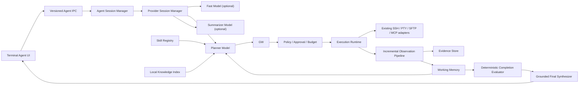

## Context

现有 Agent Harness 已建立正确的安全控制平面，但运行时体验与答案质量仍有以下差距：

| 现状 | 用户影响 | V2 目标 |
| --- | --- | --- |
| OpenAI Compatible 调用整轮完成后返回 | 长时间看不到模型反馈 | 从 Provider 到 Renderer 的端到端流式事件 |
| 部分 Provider 每轮创建 Agent、读取账号或启动 thread | 首轮和后续回合都有固定开销，任务上下文难复用 | task-scoped Provider Session |
| Execution Runtime 主要发送计时心跳 | UI 显示“运行中”但不知道命令是否有输出 | 真实 stdout/stderr 字节和安全尾行进度 |
| 普通 Shell 输出缺少通用事实抽取 | Completion Evaluator 常因 facts 为空而无法形成好结论 | 规则优先、带证据区间的事实候选 |
| 最终结论主要拼接前几条事实 | 答案机械，不能围绕用户目标综合 | 确定性完成判定 + grounded synthesis |
| 单一模型配置缺少能力探测 | 用户不知道模型是否适合工具 Agent | 模型角色、契约探测和兼容等级 |
| 运维经验只能重复写进 prompt | 流程不稳定，私有知识利用不足 | 受控 Skills + 本地知识检索 |

本变更延续“确定性控制平面 + 受限模型规划”的架构。模型可以规划、压缩和表达，但不能决定自己拥有什么权限，也不能绕过策略执行动作。

## Goals / Non-Goals

### Goals

- 让 Agent 在提交、规划、执行、观察和综合每个阶段都有低延迟、真实、可取消的反馈。
- 在一个任务内复用 Provider 会话，同时保持 OpsHalo 自己的 Session State 是唯一事实源。
- 用增量 Observation 和工作记忆支持长任务，不把完整终端历史反复发送给模型。
- 将“是否完成”与“如何表述”分离，保证自然答案仍受确定性证据约束。
- 让模型配置可探测、可解释、可降级，并支持单模型和分角色模型两种部署。
- 允许通过本地 Skill 和本地知识库扩展推理上下文，但不扩展执行权限。

### Non-Goals

- 多主机 workspace、动作主机选择、跨主机并发和跨主机恢复。
- 阿里云 ECS、磁盘、安全组或其他云厂商 OpenAPI。
- 自由自治的多 Agent 群体、模型间无边界对话或模型自定义新工具。
- 公开隐藏思维链或保存 Provider 原始内部 reasoning item。
- 自动上传本地文档、终端记录或知识索引到第三方服务。

## Architecture



### Preserved trust boundary

Renderer 继续只表达意图和展示状态。Provider、Skills、知识文档和工具输出都位于不可信输入侧。主进程内的 Session Manager、Tool Gateway、Policy、Approval、Execution Runtime、Observation Pipeline 和 Verifier 构成可信控制平面。

以下不变量不可由功能开关、Provider 能力或 Skill 覆盖：

1. 每个 task 只绑定启动时的单一 SSH/terminal session fingerprint。
2. 所有工具动作逐个形成 ToolIntent，并逐个经过 Gateway、Schema、Policy、Budget 和 Audit。
3. Provider 无法持有 SSH、PTY、SFTP 或 MCP 执行句柄。
4. 变更动作必须审批，执行后必须验证；回滚是新的受控动作。
5. 原始输出在进入 Renderer、模型、日志和持久化前先清洗与脱敏。
6. 状态机和 Invocation Ledger 是任务状态的唯一事实源；Provider thread 只保存推理上下文。

## Decisions

### 1. 端到端流式事件，不暴露隐藏推理

Provider adapter 返回 `AsyncIterable<ProviderEvent>`，Session Manager 将其转成版本化 `AgentEvent`。允许展示的增量仅包括：

- 助手面向用户的文本草稿；
- 预定义阶段，如“理解目标”“整理证据”“等待远端输出”；
- 简短的计划/依据摘要；
- 工具名称、参数摘要、风险结果、真实执行进度；
- token/时间预算和最终答案。

Provider 的 reasoning token、encrypted reasoning item、内部 chain-of-thought、原始请求和原始响应不得作为事件或日志输出。若 Provider 将 reasoning 与文本混合，adapter 必须仅转发明确标记的 user-facing content；无法区分时只发送预定义阶段。

### 2. Provider Session 以 task 为生命周期

新增 `ProviderSessionManager`。每个 Agent task 在首次需要模型时创建一个 session handle，在任务完成、取消、失败、超过空闲保留期或应用退出时关闭。

```ts
interface AgentProviderSession {
  readonly providerType: 'openai-compatible' | 'codex-subscription' | 'strands'
  readonly capabilitySnapshotId: string
  runTurn(input: ProviderTurnInput, signal: AbortSignal): AsyncIterable<ProviderEvent>
  compact?(input: CompactRequest, signal: AbortSignal): Promise<CompactResult>
  close(reason: 'completed' | 'cancelled' | 'failed' | 'expired' | 'shutdown'): Promise<void>
}
```

- OpenAI Compatible：使用流式 chat/responses 传输；每轮仍由 OpsHalo 编译完整受控上下文，adapter 不依赖服务端隐式记忆。
- Codex Subscription：账号读取使用最多 5 分钟的 profile cache；每个 task 只启动一个 thread，并在后续 turn 复用；创建时写入显式 model 和 reasoning effort。
- Strands：每个 task 复用同一 Agent 实例；工具仍为无执行权限的规划 facade，真正执行由 OpsHalo 完成。
- Provider session id 可持久化为不敏感元数据，但 OAuth token、API key 和原始 Provider transcript 不进入 task snapshot。

任务恢复时默认重新创建 Provider Session，并用 OpsHalo WorkingMemory 重建最小上下文。不得把恢复依赖于 Provider thread 永久存在。

AI 设置保存不能只依赖 renderer 的 debounce watcher。设置页提交时先合并完整配置，并显式等待 `saveUserConfig` 完成；成功后才更新 renderer 状态、显示成功提示并关闭设置页。这样“仅保存”和“测试并保存”具有相同的持久化边界，应用在保存完成后立即重启也不会丢失 backend、profile 或 Agent feature flags。OpsHalo 继续使用独立于 electerm 的应用数据目录，避免不同产品身份下的加密配置被静默混用。

### 3. 用户可见的远端动作逐条确认

当前终端中的自然语言请求由 Planner 按当前目标和最新 Observation 生成命令，不再由按产品名或关键词匹配的确定性 Router 生成 Nginx、Docker 等固定命令。所有用户可见的远端读取使用 `shell.review_exec`，所有变更使用 `shell.exec`；二者都必须逐条形成 ToolIntent、经过 Gateway，并只允许 `once` 审批范围。

- 首轮必须调用 Planner 理解本轮自然语言，不得从旧任务、示例、Skill 或知识库复制固定命令。
- 用户请求“位置/路径”时只生成返回路径的最小命令，不得附加语法校验、文件内容、include、服务状态或端口检查。
- 用户批准后，命令和输出只进入原 Shell；Observation 只保存有界副本。
- 每次 Observation 后由 Planner 重新判断目标是否满足；确有必要时再生成一条新命令并重新确认。
- 不得使用 `task_exact_match` 静默复用 Shell 授权，也不得让结构化只读工具绕开该交互链路。

内部验证器未来可以使用不面向用户的有界结构化读取，但不得用它代替用户要求在 Shell 中可见的命令。用户可见命令保持串行。

### 4. 执行进度来自真实输出字节

SSH/PTY bridge 扩展为支持 chunk callback/async iterable。Execution Runtime 分别维护 stdout/stderr 字节计数、最近安全行、最后输出时间和截断状态。

```ts
interface ExecutionChunk {
  invocationId: string
  stream: 'stdout' | 'stderr'
  sequence: number
  receivedAt: string
  bytes: Uint8Array
}

interface SafeExecutionProgress {
  invocationId: string
  stdoutBytes: number
  stderrBytes: number
  elapsedMs: number
  silentForMs: number
  safeLastLine?: string
  truncated: boolean
}
```

处理顺序固定为：UTF-8 增量解码 → ANSI/控制字符处理 → secret redaction → 行/字节上限 → UI progress 和 Observation parser。原始 chunk 只进入受 retention 控制的 Evidence writer。无输出时可以发送阶段心跳，但 payload 必须标记 `source='timer'`，不得伪装为命令输出。

事件按 invocation 合并，默认最多每秒 4 次；收到错误、提示符、进度跃迁或首个输出时可立即发送一次。背压时优先丢弃中间 UI progress，不丢弃 Evidence、最终 ExecutionResult 或错误尾部。

### 5. Observation 同时支持结构化工具和普通 Shell

Observation Pipeline 拆成确定性阶段：

1. `capture`：增量接收清洗后的行和最终 exit metadata。
2. `classify`：识别 JSON、表格、key-value、日志、命令错误或普通文本。
3. `parse`：优先使用 tool-specific parser，失败后进入 generic parser。
4. `extract`：生成 FactCandidate、ErrorSignal、MetricSample 和 EvidenceRange。
5. `validate`：检查候选事实是否能由引用文本直接支持。
6. `reduce`：按用户目标筛选、去重、排序和裁剪。
7. `persist`：保存 Observation、Fact ledger 和 Evidence ref。

```ts
interface FactCandidate {
  id: string
  statement: string
  kind: 'identity' | 'state' | 'metric' | 'relationship' | 'error' | 'absence'
  confidence: 'exact' | 'parsed' | 'heuristic'
  evidence: Array<{ evidenceId: string; start: number; end: number }>
  parserId: string
  observedAt: string
}
```

`exact/parsed` 事实可进入确定性完成判定。`heuristic` 只能作为待验证线索，不能单独支持根因或成功结论。普通文本无法可靠解析时保留为有界 observation sample，并明确 `facts=[]`，不得让模型补造结构。

### 6. 完成判定与最终表达分离

`CompletionEvaluator` 只根据目标、completion criteria、Fact ledger、ExecutionResult 和 VerificationOutcome 产生 `CompletionDecision`：

```ts
interface CompletionDecision {
  status: 'satisfied' | 'inconclusive' | 'blocked' | 'failed' | 'cancelled'
  criterionResults: Array<{
    criterionId: string
    status: 'met' | 'unmet' | 'unknown'
    factIds: string[]
  }>
  unresolved: string[]
  warnings: string[]
  maySynthesize: boolean
}
```

只有状态机决定进入终止后，`GroundedFinalSynthesizer` 才能调用 Summarizer/Planner 模型生成用户答案。输入只包含用户目标、CompletionDecision、已验证 facts、必要的短证据片段、动作结果和限制，不包含完整原始日志。

模型输出采用结构化 `FinalResponseDraft`：

```ts
interface FinalResponseDraft {
  headline: string
  answer: string
  evidenceLinks: Array<{ claim: string; factIds: string[] }>
  uncertainty: string[]
  nextActions: Array<{ label: string; kind: 'follow-up' | 'manual' | 'new-agent-task' }>
}
```

`FinalResponseValidator` 必须确认每个关键 claim 至少关联一个允许的 fact，并且措辞不超过事实状态。失败时允许同 Provider 一次结构修复；再次失败、超时或取消时，使用确定性模板生成 FinalResult，不能覆盖已有成功证据，也不能把 inconclusive 改成 completed。

对于路径、位置、版本、用户、端口和当前值等直接查询，模型提示与确定性模板都先按原始目标筛选事实，并用一句话返回请求值。命令输出中同批出现但不属于目标的语法检查、配置块或诊断信息不进入主结论。

路径或位置查询若存在唯一、与目标匹配且带当前 task Evidence 引用的已验证路径，确定性终态层直接将该目标收敛为完成；通用完成判定因同批无关输出产生的警告不得覆盖该答案。若存在同分冲突路径或缺少 Evidence 引用则保持保守状态。确定性直接答案不再进入 Grounded Final Synthesizer，避免模型重新加入无关内容。

### 7. 模型按角色配置并在保存时探测能力

模型角色：

| Role | 职责 | 最低建议 | 默认策略 |
| --- | --- | --- | --- |
| Fast | 输入分类、工具候选筛选、短字段抽取 | 低延迟、稳定 JSON、>=16k context | 可选；未配置时由确定性 router 或 Planner 代替 |
| Planner | 复杂任务分解、下一动作、信息缺口 | 可靠 structured output/tool calling、>=32k context，建议 >=64k | 必填 |
| Summarizer | Observation 压缩和最终表达 | 流式文本、引用约束、>=16k context | 可复用 Planner |
| Verifier | 完成判定、风险、审批、schema 校验 | 确定性代码 | 禁止改为纯模型决策 |

每个 model profile 包含：provider、base URL/账号 profile、model id、context limit、max output、turn timeout、streaming、structured mode、reasoning effort、temperature、prompt cache 和 concurrency。API key 或 OAuth 凭据仍使用已有安全存储，不进入 profile JSON。

保存设置时执行无服务器权限的 capability probe：

1. endpoint/model 可达和认证状态；
2. 首个 stream delta 与正常结束；
3. UTF-8/SSE 分片和 usage 解析；
4. Planner wire schema 的最小有效输出；
5. 无效结构的错误分类；
6. AbortSignal/timeout 是否能停止本地等待；
7. 声明 context/output 限制与本地预算是否一致。

能力等级：

- `automatic`：通过结构化动作、流式、取消和上下文测试，可生成受控动作并进入逐条确认循环。
- `limited`：能稳定给出文本但结构化动作不可靠，只能 suggestion mode，不得使用固定查询模板代替自然语言理解。
- `unavailable`：认证、endpoint 或基础响应失败，不能启动 Agent task。

探测结果有版本、时间、模型配置 hash 和过期时间。配置变化后立即失效；默认 24 小时后软过期，任务启动可后台复核。探测不执行任何远端服务器命令。

Agent 配置持久化后，主进程必须同步更新新 task 的 admission 与 policy。历史恢复出的 `paused` task 不属于正在执行的任务，不得阻塞配置刷新；真正处于执行、规划或验证阶段的 task 可以让 policy 更新暂缓，但运行时必须保存最新待应用配置，并在所有阻塞 task 进入 paused/terminal 后自动应用。Renderer 显示的开关与主进程 admission 不得长期分叉。

### 8. Skills 是受控流程包，不是权限包

Skill 来源分为 built-in 和 user-local。每个 Skill 使用目录与清单：

```yaml
id: diagnose-nginx
version: 1.0.0
title: Diagnose Nginx
description: Investigate Nginx availability using read-only evidence.
triggers:
  - nginx
  - reverse proxy
allowedToolCategories:
  - service
  - process
  - port
resources:
  - checks.md
```

Skill Registry 校验 id、版本、大小、资源路径和签名/来源状态。Session Manager 先只向 Planner 提供候选 Skill 的短 metadata，选中后才按上下文预算加载正文和资源。

Skill 中的命令、工具名、风险描述和“无需审批”等文字都只是建议。每个动作仍需生成 ToolIntent 并通过 Registry/Gateway/Policy。Skill 不得定义可执行 JavaScript、修改 policy、读取凭据、选择另一主机或调用未注册工具。用户 Skill 默认视为不可信提示内容，并加明确边界标签。

### 9. 本地知识库使用混合检索和来源约束

知识源首期只包括用户显式选择的本地 Markdown/Text/JSON/YAML 文档和 OpsHalo 内置运行手册。索引流程：读取 → 类型解析 → secret scan/redaction → 分块 → 本地全文索引 → 可选 embedding → 版本化元数据。

默认检索使用 BM25/FTS；用户显式启用并配置 embedding 后，使用 keyword + vector 的 Reciprocal Rank Fusion。可选 rerank 必须复用当前显式 AI 后端，不得静默调用其他云服务。

```ts
interface KnowledgeCitation {
  sourceId: string
  sourcePath: string
  sourceVersion: string
  chunkId: string
  startLine?: number
  endLine?: number
  score: number
  retrievedAt: string
}
```

知识片段作为不可信参考上下文，不能视为服务器当前状态。涉及当前配置、进程、端口、日志或变更结果的结论仍需当前主机 Evidence。知识答案必须展示来源；索引删除或源文件变化后，旧 citation 标记 stale 并不再自动加载。

### 10. 输入与 UI 以真实反馈为中心

- Shell 模式保持原有原始终端输入。
- Agent 模式将输入提交给 Agent；`Shift+Enter` 在有输入时强制按自然语言 Agent 请求处理，用于避免命令/自然语言分类歧义。
- 通用设置首屏固定展示系统界面语言；AI 设置中的回答语言是独立字段，Provider preset 和 Agent 配置不得覆盖系统界面语言。
- 提交后立即插入本地 `session.accepted` 状态，随后显示 Provider 阶段或文本增量。
- Agent 保留现有 React 卡片、审批按钮、步骤详情和证据入口，但卡片宿主改为 xterm buffer marker 对应的 decoration。Renderer 为卡片在 buffer 中预留精确行数，使卡片与 Shell 输出共享同一 scrollback 顺序；不得再用相对 viewport 的绝对定位 overlay。
- 正在流式输出时允许 Stop；Stop 同时取消 Provider turn、待执行 bundle 和运行中的 Execution Runtime。
- 屏幕阅读器只播报阶段变化、审批请求和最终结果，不逐 token 播报。
- UI 不显示“正在思考的详细过程”，只显示简短计划、依据摘要、动作和可引用证据。
- `shell.review_exec` 的嵌入审批卡展示待执行命令、风险和目标，并提供“执行 / 修改 / 拒绝”按钮；R5 不提供执行入口。批准执行后完整审批内容在原 marker 切换为绿色只读的“已执行步骤”确认卡，保留命令、风险、目标和说明，只移除操作按钮；命令文本和完整 stdout/stderr 由 Shell 紧随其后展示。拒绝或修改但尚未执行的卡片仍可保留为历史。
- Enter 提交时从 xterm 当前逻辑行读取提示符后的完整文本，范围包含光标右侧和 wrapped continuation；执行前先移至行尾再清除整行，避免中间光标截断目标或留下输入后缀。
- 每轮 Observation 后，`evaluating` 可以直接进入 `policy_check` 并发布下一条 `action.proposed`。存在必要后续探查时不得先进入 `complete`，也不显示“继续检查”中间按钮。
- 变更 VerificationPlan 的 Shell postcondition 不在后台自动执行，而是逐条转换为新的嵌入审批卡。审批识别同时依据 `pendingApproval` 和稳定状态，抵抗 event/snapshot 投影时序差。Agent 模式的自然语言由 Renderer 本地草稿缓冲接管并绘制到 xterm，提交前不发送到远端 PTY；提交后将原提示符和自然语言固化为本地 xterm 历史。旧版本残留输入使用 `Ctrl+E, Ctrl+U` 兼容清理，从数据层避免新问题与旧输入在远端拼接。发布该交互修复时必须更新应用版本及静态资源 URL，避免 Electron/Chromium 复用同版本旧 bundle；内置文件服务必须让 HTML、主 JS 和主 CSS 每次重新校验，只允许带内容哈希的动态 chunk 使用 immutable 强缓存。
- Shell/Agent 模式入口在终端控制栏始终可见。Agent 开关尚未启用或配置不完整时，点击 Agent 只打开 AI 配置，不改变当前 Shell 路由，也不创建 task 或接管终端输入。
- 初始规划、执行和分析过程使用两行 buffer 高度的紧凑嵌入卡，仅展示一行当前状态；审批或终态内容到达时，若光标仍紧邻该卡，则扩展实际预留行数并显示完整内容。
- 每张卡通过 `registerMarker()` 与 `registerDecoration()` 绑定到创建时的绝对 buffer line。卡片占用的空白行是真实 scrollback 位置，外层高度与 decoration 行数一致；不得保留超出卡片的空洞，也不得按 viewport 滚动重算 top/bottom。
- 用户批准建议后，Renderer 保留当前审批卡的 marker，把 decoration 冻结为完整只读确认卡并按其实际内容重新测量占位；Shell 命令、stdout、stderr 与新提示符从该记录之后继续。若 Planner 需要第三步或更多步骤，下一张紧凑卡在最新 Shell 输出之后创建。完整确认卡、拒绝、修改和终态结果等历史卡不被后续 snapshot 移动、覆盖或删除。
- Renderer 在审批卡成功冻结后为 approval request id 保留本地已消费标记，并按 snapshot version、event sequence 和投影时间选择命令执行期间暂存的最新状态。延迟或乱序到达的同一 `awaiting_approval` snapshot 被丢弃，不能在 Shell 输出后复活旧审批卡或创建第二张确认卡。
- 终态正文 `finalResult` 到达后，Renderer 在最新输出之后创建“已结束 · 第 N 步”结果卡并展示面向用户的分析概括，再在卡片下方恢复可输入的 Shell 提示符。仅包含终态状态、尚无 `finalResult` 的中间事件不得渲染为空标题卡。卡片扩容完成后将结果卡开头带入可见区域；长结果可仅通过终端 scrollback 连续查看，正文不得裁在终端边界之外。结果卡直接展开已有分析依据，不再提供重复的“查看证据”“清理证据”或“继续追问”按钮；新问题直接从后续提示符提交。若终态 snapshot 早于 PTY 输出完成，Renderer 必须暂存该 snapshot，直到 xterm 已解析完整 stdout/stderr 和命令结束后的新提示符，不能把分析卡插到输出中间。终态不显示预算上限或推测总步数；`inconclusive`、预算耗尽和提前结束仍在概括正文中如实说明，不以“未能完成”作为标题，也不直接暴露“证据不足”、`observed` 等内部证据判定术语。
- xterm 原生 decoration 仅依据 marker 首行决定 DOM 显隐，无法直接覆盖高卡片的部分可见场景。Renderer 保留 marker 和真实预留行，同时在每次 decoration render 时按 `[marker.line, marker.line + rows)` 与当前 viewport 的交集纠正 `display/top/height`，因此卡片仍属于原 buffer 位置，并可通过终端滚动条连续回看。
- 完整审批卡和结果卡先以最小行数挂载，再在 React 完成渲染后测量真实内容高度，按 cell 高度向上取整补足 xterm buffer 行。结果卡的分析依据展开/收起事件再次触发测量；当该卡仍紧邻当前提示符时，Renderer 先保存当前提示符行，调整真实 buffer 行数，再把提示符及光标恢复到卡片之后。卡片及其正文禁用内部纵向滚动，长内容随 decoration 完整展开，滚动职责只属于终端 scrollback。
- 若首次测量时 decoration 或 React 内容尚未挂载，完整卡片保持待测标记；xterm `onRender` 完成后自动重新排队测量。终态写回 Shell 提示符后仍执行一次兜底测量，因此默认已展开的非成功终态不能停留在两行规划高度，也不能让提示符覆盖正文。
- 已批准审批卡转入下一轮紧凑规划时，旧审批卡原位保留完整只读内容和对应实际高度，新卡在最新提示符后独立以两行创建，不得继承旧卡高度。Playwright Electron 统一注入仓库内独立 `DATA_PATH`，避免测试 `setConfig` 和自动保存观察器写入真实 `~/Library/Application Support/OpsHalo`；配置重启测试在隔离目录内执行并恢复原测试配置。
- 后台恢复或延迟到达的非活动 task snapshot 不得抢占同一 tab 已显式启动的当前会话。失败终态只写一次用户结果，隐藏重复 timeline 投影，并将内部状态翻译为可理解的说明。

#### Shell 与 Agent 的显示职责

| 内容 | 展示位置 |
|---|---|
| 自然语言目标、简短计划、风险说明 | xterm marker 上的嵌入卡片 |
| 待批准命令与操作按钮 | xterm marker 上的嵌入审批卡 |
| 已批准命令、stdout、stderr、退出状态、Shell 提示符 | 当前终端 |
| 已完成步骤的完整确认内容 | 冻结在原 buffer line、按实际内容高度展示的只读确认卡 |
| 下一条必要命令 | 最新 Shell 输出之后的新嵌入审批卡 |
| 最终摘要 | 最新输出之后的“已结束 · 第 N 步”结果卡 |

该分工不改变 Evidence Pipeline：终端输出仍经执行桥进入脱敏、Observation、Evidence 和完成判定；卡片只投影分析、审批和结果，不得代替终端原生命令输出。

### 11. 可观测性和评测是发布门槛

每个 task 记录不含敏感内容的指标：

- `submit_to_ack_ms`
- `submit_to_first_lifecycle_ms`
- `provider_time_to_first_delta_ms`
- `execution_start_to_first_output_ms`
- `observation_to_next_decision_ms`
- `completion_to_final_ms`
- provider/model turn 数、tool invocation 数、retry/repair 数
- 输入/输出 token、context utilization、Evidence 数、终止原因
- 用户 cancel、approval 等待和 terminal handoff 时间单独计量

延迟报告必须区分本地开销、Provider 网络/排队、远端命令运行和用户等待。不能用平均值掩盖 P95，也不能把审批等待计入模型性能。

### 12. Mini 产品面与发行代码必须一致

Mini 发行物的正式产品面限定为当前 Renderer 可达的 SSH/SFTP、本地终端、AI、主题、同步与工作区。Telnet、Serial、FTP、RDP、VNC、SPICE 和 Web 会话没有新建连接或书签入口，不再作为休眠实现保留。

清理使用“入口到实现”的可达性审计，而不是按目录名直接删除：

1. 从 Renderer 路由、菜单、设置项、快捷键、IPC 和启动恢复入口建立可达清单；
2. 追踪 Main/Session Server、preload、构建脚本、依赖和测试消费者；
3. 先删除前端入口已经不存在且没有保留消费者的完整功能族；
4. 再删除只被这些功能族引用的专用依赖、构建 stub、资源和测试；
5. 对共享存储字段和历史数据只做被动兼容，不重新暴露已移除功能，也不破坏旧版本回滚读取。

Widget、Quick Command、Batch Operation、Profile 和 MCP 不能仅因设置页隐藏就直接删除。若 Agent、SSH 认证、同步迁移、启动恢复或其他可见工作流仍有消费者，则保留最小共享实现；只有静态引用与运行时入口均不可达时才删除整个功能族。

构建验证必须扫描编译产物和依赖树，证明已移除协议没有被静态导入、动态加载或打包。使用空组件替换重型会话只能作为迁移期间的临时措施，最终发行配置中不得继续保留相应 stub 和专用依赖。

macOS 本地验收必须启动 electron-builder 生成的独立 `OpsHalo.app`，不能把 `node_modules/electron/dist/Electron.app` 当作用户应用交付。退出后从相同 app bundle 再次启动时，入口必须仍指向 OpsHalo 的 `app.asar`，不得回退到 Electron 的 `default_app.asar` 欢迎页。

### 13. Codex 原生运行时改为固定版本按需安装

从 1.0.26 起，生产依赖和安装包不再携带 `@openai/codex` 及平台原生包。主进程持有固定的 Codex `0.147.0` manifest；每个受支持的 `platform:arch` 条目包含唯一官方 HTTPS tarball、SHA-512、精确压缩大小、npm 包内三元组、目标可执行文件与允许文件前缀。清单不提供 `latest` 解析或任意 URL 覆盖。

运行时管理器位于 Renderer 信任边界之外，并按以下阶段运行：

1. 解析高级配置中的绝对可执行文件；存在且有效时直接使用。
2. 检查 `<userData>/agent/codex-runtime/<version>/<platform>-<arch>` 中的安装标记和可执行文件。
3. 在系统 `PATH` 和当前用户的标准 CLI 目录中发现已有 `codex`，但必须先通过可识别的 `--version` 与 App Server `initialize` smoke 才能复用；本机 CLI 由用户自行维护，不受下载清单版本约束，但不得执行其他名称、Shell alias 或未经验证的命令。
4. 只有 OAuth、设备码、刷新或重新授权的显式用户动作可在前述来源均不可用时调用 `ensureRuntime({ allowDownload: true })`；Agent Planner 只调用 `allowDownload: false`。
5. 使用 Electron `net.fetch` 下载到 `.downloads` 分片，利用 ETag 与 `Range` 续传；相同 manifest key 复用同一 Promise 与 AbortController。
6. 校验响应来源、长度上限和 SHA-512；安全检查 tar entry 后解压到同文件系统的 staging 目录。
7. 使用隔离的临时 `CODEX_HOME` 执行 `--version` 与 App Server `initialize`，成功后写入不含 URL 的安装标记并原子 rename。
8. 原子切换成功后才清理其他版本；任一步失败都保留旧可用版本。校验失败删除损坏分片，用户取消则保留可恢复分片。

运行时目录和文件使用仅当前用户可访问的权限。持久化元数据只允许版本、平台、架构、内容完整性标识、ETag、字节数和安装时间；不得出现账号 Token、用户目标、命令、任务输出或下载 URL。

`CodexAppServerManager.startLogin()` 必须先确保运行时就绪，再创建新 profile，以免下载失败留下错误账号。已有 profile 的刷新与重新授权失败时只返回运行时错误，不改变账号认证状态、当前 profile 或 Agent feature flags。OpenAI Compatible 后端完全绕过运行时管理器。

Preload 增加 `getRuntimeStatus()`、`cancelRuntimeDownload()` 和 `onRuntimeEvent(handler)`，但状态投影只包含 `missing | downloading | verifying | ready | failed`、版本、平台、架构、字节进度和脱敏错误。路径、URL、完整性值及进程能力只保留在主进程。

配置页在缺失状态把固定压缩大小显示在两个账号按钮上。用户点击后显示下载进度和取消入口；验证完成自动继续 OAuth。失败保留可读错误和重试入口。Agent 模式在运行时缺失时只引导到配置页，不得后台下载。

发布工作流在各目标平台先于打包执行真实固定运行时 smoke，并在临时目录清理测试缓存。成品扫描拒绝任何 Codex npm 包或原生二进制；Windows installer 必须小于 100 MB，macOS DMG、Linux DEB/RPM/AppImage 必须小于 130 MB，Linux/Windows tar.gz 必须小于 160 MB。

## Detailed Data Contracts

### Provider event

```ts
type ProviderEvent =
  | { type: 'phase'; phase: ProviderPhase; safeMessage: string }
  | { type: 'text.delta'; delta: string }
  | { type: 'decision.delta'; field: string; delta: string }
  | { type: 'decision.completed'; decision: PlannerDecisionWire }
  | { type: 'usage'; inputTokens?: number; outputTokens?: number; cachedTokens?: number }
  | { type: 'completed'; finishReason: string; providerRequestId?: string }
  | { type: 'error'; error: SafeProviderError }
```

`decision.delta` 只用于累积和显示预定义阶段，不直接执行。完整 decision 必须在 schema decode、Zod、Tool Registry 和 Policy 验证后才能产生 action。

### V2 Agent events

在现有 envelope 上新增以下类型，`schemaVersion` 升为 2：

| Event | Payload | Persistence | UI |
| --- | --- | --- | --- |
| `session.accepted` | taskId、local timestamp | audit | 立即显示已接收 |
| `provider.session_started` | provider type、model、capability level | metadata | 显示连接阶段 |
| `provider.phase` | enum、safe message、elapsed | no transcript | 更新状态行 |
| `assistant.delta` | responseId、sequence、sanitized text delta | bounded draft | 增量文本 |
| `assistant.completed` | responseId、safe text、status | final response | 固化文本 |
| `execution.output_progress` | byte counts、safe last line、source | coalesced | 真实命令进度 |
| `observation.updated` | new fact ids、error ids、evidence refs | observation | 更新事实/证据 |
| `knowledge.retrieved` | citation metadata、count | provenance | 显示来源 |
| `usage.updated` | tokens、turns、context utilization | aggregate | 可选详情 |

Renderer 对 `assistant.delta` 按 `responseId + sequence` 去重。发生序列缺口时请求 snapshot；snapshot 只包含当前安全文本，不包含已丢弃的原始 Provider chunks。

### Model profile

```ts
interface AgentModelProfile {
  id: string
  role: 'fast' | 'planner' | 'summarizer'
  backendType: 'openai-compatible' | 'codex-subscription'
  providerProfileId: string
  model: string
  contextWindow: number
  maxOutputTokens: number
  turnTimeoutMs: number
  streaming: boolean
  structuredMode: 'native-tools' | 'json-schema' | 'strict-json'
  reasoningEffort?: 'minimal' | 'low' | 'medium' | 'high'
  temperature?: number
  promptCaching?: 'auto' | 'off'
  maxConcurrentTurns: 1
}
```

同一 Agent task 的 Planner session 永远 `maxConcurrentTurns=1`。只读 tool bundle 并发不等于模型 turn 并发。

## State and Concurrency

现有单写者 mailbox 继续串行提交状态变化。并发只发生在 mailbox 外部的受控 effect 中，完成结果带 invocation id 回到 mailbox，再按确定性顺序归并。

并发只读 bundle 的归并顺序使用 Planner 原始 action 顺序，而不是完成时间，避免不同网络速度导致 prompt 和测试不稳定。一个动作失败不取消其他独立动作；task cancel 则取消全部。任何 action 返回 `binding_mismatch`、`policy_changed` 或 `unknown_remote_state` 时，bundle 剩余未发送动作立即停止。

Provider turn、final synthesis 和 context compaction 对同一 task 互斥。普通 follow-up 仅在上一轮进入稳定终止状态后开启同 task 新 turn；但上一 task 已稳定停在 `pendingApproval` 时，用户可从新提示符创建独立 task，旧审批保持可操作。其他运行中输入仍用于 cancel、approval 或 terminal handoff，不在同一 task 内并发创建第二 Planner。

## Context Budget

上下文按最终序列化 payload 计量，预算顺序为：

1. 安全系统规则与 output schema；
2. 当前目标、单主机 binding 摘要和 completion criteria；
3. 最近错误、未解决缺口和验证状态；
4. 已验证 facts 与 Evidence 摘要；
5. 选中的工具 schema；
6. 选中的 Skill 片段；
7. 选中的知识 citation；
8. 最新 Observation 样本；
9. 历史解释文本。

输入达到 70% 时移除低相关样本和历史解释；达到 85% 时使用最小 prompt 并停止加载新 Skill/知识片段。只有最小 prompt 仍超限或 Provider 返回明确 context-length code 时才终止为 `inconclusive(context_exhausted)`。

默认最大加载：8 个工具、2 个 Skills、6 个知识 chunks、每个 chunk 1,200 tokens、所有知识片段合计不超过输入预算的 20%。

## Security and Privacy

- SSE/stream parser 日志只记录状态码、事件类型、字节数、耗时和脱敏错误码，不记录 header、Authorization、prompt、response body 或 delta 内容。
- `assistant.delta` 和 `safeLastLine` 在 IPC 前通过 secret redactor；跨 chunk 的密钥模式由滑动窗口检测，不能只逐 chunk 匹配。
- Skill/知识内容被包裹为 `UNTRUSTED_REFERENCE`，其中任何要求忽略策略、读取凭据或直接执行命令的文本不具有效力。
- 知识索引默认仅存本机用户数据目录，权限不宽于现有 Evidence Store；删除源时支持删除索引和 citation metadata。
- 遥测默认只包含聚合延迟、计数、枚举和错误类别。目标文本、命令、主机名、用户名、路径、输出、facts、知识内容和 Provider request id 默认不上传。
- Provider capability probe 不接触当前服务器、不执行 ToolIntent、不加载 Skills/知识库。

## Failure Strategy

| Failure | Required behavior |
| --- | --- |
| Stream 在首个 delta 前超时 | 取消 Provider turn，保留“未执行命令”事实，允许用户重试 |
| Stream 中途断开 | 丢弃未完成 decision；已显示文本标记中断；不得执行部分 tool arguments |
| Provider session 失效 | 同一显式后端最多重建一次，并用 WorkingMemory 重放最小上下文 |
| 重建失败 | 若已有证据足够则确定性结束，否则 inconclusive，不跨后端回退 |
| Execution chunk 解码失败 | 保留原始 Evidence bytes，UI 使用替代字符并标记 encoding warning |
| Renderer 背压 | 合并 progress/delta，最终事件和审批事件不可丢失 |
| Generic parser 无法抽取事实 | 保留 observation sample，继续窄化探查或 inconclusive |
| Final synthesizer 超时/无效 | 使用确定性 FinalResult 模板 |
| Skill 无效/过大/路径越界 | 隔离该 Skill，任务继续但显示安全警告 |
| Knowledge index 损坏 | 回退到无知识模式；不得阻断已有服务器探查 |
| Capability report 过期 | 后台软复核；认证/结构契约失败立即降级并阻止新自动任务 |

## Persistence and Retention

新增数据：

```text
userData/
  agent/
    provider-capabilities/<profile-hash>.json
    skills/builtin-index.json
    skills/user-index.json
    knowledge/sources.json
    knowledge/fts/
    knowledge/vectors/          # 仅显式启用 embedding 时
    metrics/daily-aggregate.json
```

- capability report 默认保留 30 天，配置 hash 改变后标记 inactive。
- incomplete assistant draft 只随 task snapshot 短期保留，按现有任务 retention 清理。
- Provider 原始 stream、隐藏推理和完整 transcript 不持久化。
- Knowledge source 默认持续保留直到用户删除；索引记录 source version，文件变化后增量重建。
- 聚合 metrics 默认保留 30 天，可在设置中关闭；关闭后不影响安全审计。

## Migration and Rollout

### Feature flags

按以下顺序灰度，后一步依赖前一步稳定：

1. `agentProviderStreamingV2`
2. `agentExecutionOutputProgressV2`
3. `agentPersistentProviderSessionV2`
4. `agentGroundedFinalSynthesisV2`
5. `agentReadProbeBundleV2`
6. `agentModelProfilesV2`
7. `agentSkillsV2`
8. `agentKnowledgeBaseV2`

安全修复、脱敏和 capability probe 不得因 UI 灰度而产生旁路。任一 flag 关闭时回退到旧行为，但 Tool Gateway/Policy/Approval/Evidence/Verification 始终启用。

### Configuration migration

1. 读取旧 `provider/baseUrl/model/apiKey` 或 Codex profile。
2. 创建 Planner profile；Fast/Summarizer 以 `inheritFrom=planner` 表示复用，不复制凭据。
3. context/max output/timeout 使用安全默认并标记 `needsProbe=true`。
4. 首次打开设置显示能力未验证，不阻断现有聊天；首次启动自动 Agent 前必须探测。
5. 用户回滚版本时保留旧字段，V2 profile 作为未知附加配置被忽略。

### Release gates

- Phase 1：仅开发者开关，假 Provider/假 SSH 契约测试通过。
- Phase 2：内部只读任务，真实 Provider + 隔离 SSH smoke 通过。
- Phase 3：小比例用户启用 streaming/session/synthesis，监控 P50/P95、取消和失败分类。
- Phase 4：Skills 默认可用但无用户目录自动扫描；知识库必须用户显式添加来源。
- 任何 R2+ 未审批执行、主机 binding 错误、秘密泄漏或 partial decision 被执行都立即关闭相关 flag。

## Risks / Trade-offs

- **流式协议兼容差异**：Provider 对 SSE、tool delta、usage 和 finish reason 的实现不一致。通过 adapter contract fixture、增量 UTF-8 parser 和 capability probe 隔离差异。
- **会话复用带来陈旧上下文**：OpsHalo WorkingMemory 仍是事实源；每轮发送 snapshot version，恢复时重建最小上下文，Provider 记忆不得覆盖本地状态。
- **只读并发放大负载**：默认并发 2、最大 3，仅 `parallelSafe` 工具；引入每主机和每任务 rate limit，并保留串行回退。
- **自然语言总结可能夸大事实**：确定性 evaluator 先决定状态，claim 必须绑定 facts，无效时回退模板。
- **知识文档可能过期或含提示注入**：显示版本/来源，标记为参考，服务器当前状态必须由实时 Evidence 验证。
- **多模型配置增加复杂度和成本**：默认单模型复用；只有用户显式配置角色模型才拆分，UI 展示预计能力和最近 token 指标。
- **真实 Provider 延迟不可完全控制**：分别记录本地、网络、Provider 和远端命令耗时；本地阶段保持即时反馈和可取消。
- **第三方项目许可证风险**：只参考公开功能目标和协议思想，执行 clean-room 设计审查，不复制 Chaterm GPL 源码。

## Confirmed Defaults

- 单主机 task binding，不新增 workspace 主机选择。
- 不新增阿里云或其他云资源 OpenAPI。
- Planner 必填；Fast/Summarizer 默认复用 Planner；Verifier 保持确定性。
- Provider turn 默认超时 45 秒，final synthesis 默认超时 20 秒；用户 cancel 无条件优先。
- 自动只读 bundle 默认并发 2、最大 3；默认仍优先单动作。
- assistant delta 最大每秒 20 次，execution progress 最大每秒 4 次；最终事件不节流。
- 知识库默认全文检索；embedding 和 rerank 默认关闭。
- Skills 和知识都不能扩大工具权限，也不能改变审批或单主机绑定。
- 不持久化隐藏思维链、Provider 原始 stream 或完整 transcript。
